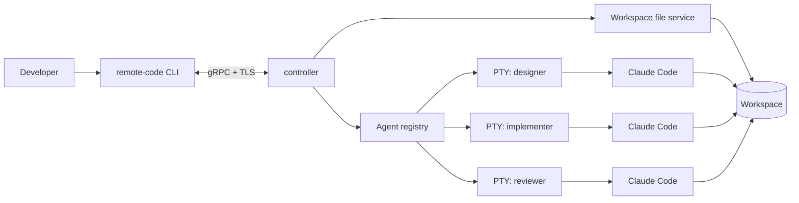

# Remote Code

Remote Code 是一个面向远程开发任务的 Code Agent 控制平面。它在远程机器上运行
`controller`，通过 gRPC 接受本地 `remote-code` CLI 的请求，管理工作区文件以及通用
受管进程。Claude Code 接入将建立在这套通用进程能力之上，目前不需要 Claude 凭据。

> 项目状态：文件与基础进程控制已可运行，包含带 Tab 补全的交互式 CLI、结构化目录树、
> gRPC controller、流式上传/下载、PTY/pipe 启动、可回放/跟随的持久化输出日志、进程列表、
> 信号、历史删除、自动回收、重启历史恢复、可重连的远程 PTY attach、可同时观察和操作多个 PTY 的
> Client 多窗口界面，以及由 JSON Schema 和受限
> Expr 驱动的服务端进程模板。controller 也可从多个
> `.mcp.yaml` 文件加载 Expr tool，并通过带认证的 Streamable HTTP MCP endpoint 暴露 controller 信息、
> 有界文件读取/搜索/补丁、进程快照/偏移日志、进程模板和 binary workspace Resource。
> controller 自身的生命周期、进程服务和 MCP 诊断也会以脱敏 JSON 事件持久化，并可通过
> `ControllerService.ObserveControllerLogs` 或 CLI 的 `controller-logs`/`clogs` 回放、续读和 follow。
> MCP listener 可配置独立于 gRPC 的 bearer token。
> controller 还包含默认关闭的内部 Workflow core：它可在启动期校验静态 DAG/Expr，并通过持久
> Activity、lease、人工介入和 bbolt 事件存储恢复运行；当前尚未提供 Workflow RPC/CLI 或真实 Agent
> 执行适配器。
> 进程与日志相关的错误携带机器可读的 reason，客户端不必匹配消息文本即可区分共用同一 status code
> 的多种条件。
> Agent 语义仍是后续版本计划。

## 功能与使用文档

- [Controller 功能介绍与使用指南](docs/controller-guide.md)：架构、功能边界、配置、生产部署、
  进程模板、MCP、持久化恢复、运维和安全清单。
- [Client 功能介绍与使用指南](docs/client-guide.md)：交互式 CLI、完整命令参考、文件断点续传、
  PIPE/PTY 进程、attach、典型工作流和公共 Go client 接入。
- [Client 多窗口交互详细设计 v1](docs/client-multi-window-design-v1.md)：命令与按键、平铺布局、
  虚拟终端隔离、attachment 生命周期、并发模型和测试边界。

## 快速开始

本项目当前要求 Go 1.26。构建并启动本地 controller：

```bash
go build ./...
go test ./...
make build

./bin/remote-code-controller --config ./bin/remote-code-controller.toml
```

在另一个终端连接：

```bash
./bin/remote-code --controller-addr 127.0.0.1:9443
```

连接后可使用文件命令以及 `exec`、`ps`、`kill`、`stdin`、`attach` 进程命令，输入 `help` 查看完整说明。例如：

```text
remote-code:/> info
remote-code:/> mkdir -p docs/input
remote-code:/> upload ./requirements.md docs/input/requirements.md
remote-code:/> ls -l docs/input
remote-code:/> download docs/input/requirements.md ./requirements.copy.md
remote-code:/> cd docs/input
remote-code:/docs/input> exec --name listing -e LANG=C ls -la
remote-code:/> exec --name interactive --pipe --stdin cat
remote-code:/> stdin interactive
remote-code:/> exec --attach --name editor vim test.txt
# detach 后可再次执行：attach editor
# 同屏打开多个已运行的 PTY；Ctrl-] ? 查看窗口快捷键
remote-code:/> windows designer implementer reviewer
remote-code:/> ps
remote-code:/> ps -a
remote-code:/> logs -n 100 --follow 7aa5daab-e886-4889-9ec3-92d461883091
# 按 Ctrl-C 停止 follow；远端进程继续运行
remote-code:/> controller-logs -n 100
# controller-logs 输出结构化 JSON；--follow 可观察 controller 关闭前的事件
remote-code:/> kill -s TERM -w listing
remote-code:/> forget listing 'test-*' glob:reused-name
remote-code:/> templates
remote-code:/> templates code-agent
remote-code:/> exec-template --attach --params-file ./agent-parameters.json code-agent
```

默认仅允许 loopback 明文监听。远程部署应配置 `--tls-cert`、`--tls-key` 和
`--token-file`；完整参数、行为与安全限制见
[首版需求](docs/requirements-v1.md)、[通用进程需求](docs/process-management-requirements-v1.md)、
[技术方案](docs/technical-design-v1.md)、[通用进程详细设计](docs/process-management-design-v1.md)、
[进程日志观测详细设计](docs/process-log-observation-design-v1.md)、
[进程标准输入详细设计](docs/process-input-design-v1.md)、
[Client 多窗口交互详细设计](docs/client-multi-window-design-v1.md)、
[进程模板详细设计](docs/process-template-design-v1.md)、
[错误模型详细设计](docs/error-model-design-v1.md)以及
[Controller 配置文件](docs/controller-configuration.md)。工作流内部模块见
[工作流需求](docs/workflow-requirements-v1.md)与[工作流详细设计](docs/workflow-design-v1.md)。可配置 MCP Server 的契约与实现依据见
[MCP Server 需求](docs/mcp-server-requirements-v1.md)和
[MCP Server 详细设计](docs/mcp-server-design-v1.md)。

MCP 默认关闭。启用时使用 TOML schema v2 或更高版本，配置独立 HTTP listener、bearer token 和
workspace 之外的定义文件。MCP 默认复用 gRPC 的 bearer token；`mcp.token_file`（schema v7，命令行
`--mcp-token-file`）可为 MCP listener 配置独立凭据，使 MCP 客户端持有的 token 不再等同于完整 gRPC
权限。取舍与剩余缺口见[授权模型现状与演进](docs/authorization-model-v1.md)。仓库提供可直接参考并通过启动期编译检查的
[`controller.mcp.yaml`](configs/mcp/controller.mcp.yaml)、[`file.mcp.yaml`](configs/mcp/file.mcp.yaml) 与
[`process.mcp.yaml`](configs/mcp/process.mcp.yaml)。`--check-config` 会读取严格 YAML、编译 JSON Schema
与 Expr，但不会绑定端口或执行 host function。示例默认不发布删除、chmod、任意 signal、stdin、PTY attach
或日志 follow；`files.read` 还会启用只读的 `workspace:///{+path}` binary Resource template。

controller 同时保留全部命令行参数。使用配置文件时，显式命令行参数覆盖 TOML，例如：

```bash
./bin/remote-code-controller --config /etc/remote-code/controller.toml --max-processes 32
./bin/remote-code-controller --config /etc/remote-code/controller.toml --check-config
```

## 使用场景

1. 在远程服务器启动 `controller`，并将它限制在指定的工作目录中。
2. 使用 CLI 上传需求文档、设计稿或其他任务输入。
3. 在工作区中启动一个或多个 Claude Code agent，例如分别承担设计、实现和 review。
4. 从 CLI 查看 agent 状态、接入实时终端、发送输入并持续读取输出。
5. 任务结束后停止 agent，下载产物，或关闭整个 controller。

## 设计目标

- 通过一个长期运行的 controller 统一管理 agent 的启动、停止和状态。
- 保留 Claude Code 的交互式体验，支持终端尺寸变化、流式输入和流式输出。
- 支持断开后重新接入，并保留有限的输出历史。
- 提供受工作区边界约束的文件上传、下载、浏览和删除能力。
- 支持多个 agent 并行工作，清楚呈现各自的身份、角色和生命周期。
- controller 和 CLI 均使用 Go 实现，并通过版本化的 gRPC API 通信。

首个版本不以容器编排、多租户调度、Web UI 或通用 Agent SDK 为目标。

## 总体架构



controller 是唯一的远程入口，负责认证、路径校验、进程注册、进程回收和事件转发。
每个受管进程运行在独立进程组中；PTY 模式还拥有独立 session 和控制终端。CLI 组合输入流与
日志 follow 流接入对应 PTY，不需要额外的 Attach API。

## 核心概念

- **Workspace**：controller 启动时指定的根目录。所有文件操作和 agent 工作目录都必须位于该目录内。
- **Process**：一个通用受管进程，拥有稳定 UUID、逻辑名称、PID、启动参数和持久化生命周期状态。
- **Agent**：后续建立在 Process 之上的 Claude Code 语义层。
- **Attachment**：CLI 与受管进程 PTY 的一次连接。网络断开不等同于终止进程，之后可以重新接入。
- **Event**：带递增序号和时间戳的输出、状态变化或错误，可用于断线续传和审计。

建议的 agent 状态机：

```text
CREATED -> STARTING -> RUNNING -> STOPPING -> EXITED
                       |    |
                       |    +-------------> FAILED
                       +------------------> LOST
```

## CLI 体验

当前文件控制版本使用一个长期运行的交互会话：

```bash
remote-code --controller-addr devbox.example.com:9443 \
  --tls-ca ~/.config/remote-code/ca.pem \
  --token-file ~/.config/remote-code/devbox.token
```

当前 REPL 已提供通用的 `exec`、`ps`、`ps -a`、`kill`、`stdin`、`attach` 和 `logs`；下面的 context 与 agent 命令是后续版本的产品形态草案：

以下命令用于约定产品形态，并不表示已经实现：

```bash
# 连接远程 controller
remote-code context add devbox --address devbox.example.com:9443 \
  --ca ~/.config/remote-code/ca.pem \
  --token-file ~/.config/remote-code/devbox.token

# 管理文件
remote-code file upload ./requirements.md docs/requirements.md
remote-code file list docs
remote-code file download output/report.md ./report.md

# 启动并查看多个 agent
remote-code agent start --name designer --role design --prompt-file prompts/design.md
remote-code agent start --name implementer --role implementation
remote-code agent start --name reviewer --role review
remote-code agent list

# 接入交互终端，detach 不会结束远程进程
remote-code agent attach implementer
remote-code agent logs reviewer --follow
remote-code agent stop implementer --grace-period 10s
```

CLI 应同时支持面向人的表格输出和供自动化使用的 `--output json`。

## gRPC API

API 放在版本化包 `remote.code.v1` 中。当前实现 `ControllerService.GetInfo` 与完整的
`FileService`；Agent API 为后续规划。当前文件接口如下：

```protobuf
service ControllerService {
  rpc GetInfo(GetInfoRequest) returns (GetInfoResponse);
  rpc ObserveControllerLogs(ObserveControllerLogsRequest) returns (stream ObserveControllerLogsResponse);
}

service FileService {
  rpc Stat(StatRequest) returns (StatResponse);
  rpc List(ListRequest) returns (ListResponse);
  rpc Tree(TreeRequest) returns (TreeResponse);
  rpc Upload(stream UploadRequest) returns (UploadResponse);
  rpc Download(DownloadRequest) returns (stream DownloadResponse);
  rpc CreateUploadSession(CreateUploadSessionRequest) returns (CreateUploadSessionResponse);
  rpc TransferUpload(stream TransferUploadRequest) returns (stream TransferUploadResponse);
  rpc GetUploadSession(GetUploadSessionRequest) returns (GetUploadSessionResponse);
  rpc AbortUploadSession(AbortUploadSessionRequest) returns (AbortUploadSessionResponse);
  rpc DownloadRange(DownloadRangeRequest) returns (stream DownloadRangeResponse);
  rpc Remove(RemoveRequest) returns (RemoveResponse);
  rpc Move(MoveRequest) returns (MoveResponse);
  rpc Chmod(ChmodRequest) returns (ChmodResponse);
  rpc Mkdir(MkdirRequest) returns (MkdirResponse);
}

service ProcessService {
  rpc StartProcess(StartProcessRequest) returns (StartProcessResponse);
  rpc ListProcessTemplates(ListProcessTemplatesRequest) returns (ListProcessTemplatesResponse);
  rpc GetProcessTemplate(GetProcessTemplateRequest) returns (GetProcessTemplateResponse);
  rpc StartProcessFromTemplate(StartProcessFromTemplateRequest) returns (StartProcessFromTemplateResponse);
  rpc ListProcesses(ListProcessesRequest) returns (ListProcessesResponse);
  rpc SignalProcess(SignalProcessRequest) returns (SignalProcessResponse);
  rpc DeleteProcess(DeleteProcessRequest) returns (DeleteProcessResponse);
  rpc BatchDeleteProcesses(BatchDeleteProcessesRequest) returns (BatchDeleteProcessesResponse);
  rpc ObserveProcessLogs(ObserveProcessLogsRequest) returns (stream ObserveProcessLogsResponse);
  rpc StreamProcessInput(stream StreamProcessInputRequest) returns (stream StreamProcessInputResponse);
}
```

`TreeResponse` 使用递归的 `TreeNode` 返回文件元数据和子节点，CLI 只负责把它渲染成类似
Linux `tree` 的文本。新客户端通过 `GetInfo.file_transfers` 协商断点续传：上传使用持久化 session、
durable offset 和 checkpoint，下载使用 revision、offset 与本地前缀 SHA-256；旧 `Upload`/`Download`
RPC 继续用于兼容旧客户端和不可 seek 的流。两条路径都在完整大小和 SHA-256 校验后才原子发布。
实际 message 与流帧定义见
[`remote_code.proto`](api/remote/code/v1/remote_code.proto)，落盘顺序与故障恢复规则见
[文件断点续传设计 v1](docs/file-transfer-resume-design-v1.md)。交互式 attach 不增加专用 RPC：客户端组合
`StreamProcessInput` 与 `ObserveProcessLogs(follow=true)`，输入流同时承载有序的终端 resize 和 detach。

`StartProcess` 接受具体命令、参数、工作区内 cwd、PIPE/PTY 模式、输入模式和环境覆盖；它不经 shell
解释。每个进程具有 UUID、逻辑名称和 OS PID；pipe 与 PTY 模式都使用独立进程组，
`SignalProcess` 可按 UUID、名称或 PID 向整个组发送 HUP、INT、QUIT、TERM、KILL、
USR1、USR2、STOP 或 CONT。`DeleteProcess` 只删除一个终态进程的完整历史目录；
`BatchDeleteProcesses` 接受多个精确引用或名称 glob，按 UUID 去重并逐项返回删除状态。
直接子进程始终由 controller `Wait` 回收。

`StartProcessFromTemplate` 接受模板名称、`google.protobuf.Struct` 动态参数、可选进程实例名称和初始
终端尺寸。controller 先用模板的 JSON Schema 校验参数，再运行只能访问 `parameters` 的纯 Expr，生成
arguments、cwd 和环境覆盖，最后进入与 `StartProcess` 相同的 validator/runner。模板 executable、I/O
模式和输入模式由 operator 静态配置；模板定义在启动期编译且必须位于 workspace 外。模板启动的动态
argv 默认从 `ProcessInfo` 和持久化 metadata 中脱敏，只记录模板名称和 SHA-256 revision。

进程记录位于 `--runtime-dir/<uuid>/`。`metadata.json` 与 `status.json` 保存元数据和状态；
`logs/` 使用带 stdout/stderr tag、逻辑 offset、CRC 和 tail 索引的 v2 分段格式。PIPE 保留双流
标记，PTY 合并记录为 stdout。环境变量仅持久化 key，不持久化 value。旧双文件 v1 日志会在
加载时自动迁移。

输入模式默认 `DISABLED`，保持 PIPE 启动后立即收到 EOF 的兼容行为。显式选择 `MANAGED`
后，controller 会在进程进入 RUNNING 后继续保留输入端点，客户端可随时通过
`StreamProcessInput` attach、写入、detach 和再次连接。同一进程同时只允许一个输入 writer；
detach 或网络断开不会关闭 stdin。PIPE 支持显式关闭输入，PTY 没有独立的 write-side close，
应发送终端控制字节或使用进程信号。CLI 的 `attach PROCESS` 以 raw 模式交互并监听窗口变化；
`Ctrl-] d` detach，`Ctrl-] Ctrl-]` 向远端发送字面量 Ctrl-]。`exec --attach CMD ...`
会隐含 PTY 和 MANAGED 输入并在启动后立即连接。

`windows [-n TAIL_LINES] [PROCESS ...]`（别名 `mux`）在同一本地备用屏幕中平铺最多 9 个
MANAGED PTY。所有窗格持续刷新，键盘只发送到高亮窗格；`Ctrl-] o` 打开窗格、`Ctrl-] x` 关闭窗格、
`Ctrl-] n/p` 或 `Ctrl-] 1..9` 切换窗格、`Ctrl-] q` 返回 REPL。关闭或退出只 detach，远端进程继续运行。
每个进程输出先经过独立虚拟终端解析，因此清屏和光标控制不会影响其他窗格。

## 多 Agent 协作

多个 agent 可以读取同一工作区，但多个写入者直接修改同一份文件会产生覆盖、半成品读取和 Git
索引竞争。推荐的首版约束是：

- design 和 review agent 默认只读；
- 同一工作区默认只允许一个可写 agent；
- 需要多个 agent 并行实现时，为每个 agent 创建独立的 Git worktree，再通过提交或补丁合并；
- agent 之间通过明确的产物文件或 controller 事件协作，不隐式共享终端上下文。

## 安全边界

controller 会启动能够执行任意项目命令的 Claude Code，因此它不应直接暴露到公网。实现时至少需要：

- 默认监听 loopback；远程使用时启用 TLS，并支持 token 或 mTLS 身份认证；
- 对每个 RPC 做认证与审计，敏感字段不写入日志；
- 将所有相对路径解析到规范化路径，并拒绝 `..`、绝对路径和符号链接逃逸；
- 上传先写同目录临时文件，校验大小与哈希后原子替换；
- 为上传大小、并发 agent 数、输出缓冲和 RPC 消息大小设置上限；
- agent 使用独立进程组，停止时先发送温和信号，超时后再强制回收整个进程组；
- controller 退出时有序停止或明确托管所有子进程，避免孤儿进程；

关于命令执行，当前的信任模型是**有意敞开**的：`StartProcess` 接受调用者指定的任意可执行文件，
server 端没有命令 allowlist。命令和参数以独立 argv 元素传递，不经 shell 拼接或解释，但这只防注入、
不构成权限边界——**持有 token 等同于以 controller 的系统用户身份获得远程代码执行权限**，token 应按
SSH 私钥的等级保管。需要受约束的启动入口时使用进程模板：executable、I/O 模式和输入模式由 operator
静态配置，客户端只能传经 JSON Schema 校验的参数。但只要 `StartProcess` 保持开放，模板就是可选路径
而非强制边界，真正的隔离依赖下面的操作系统级手段而不是应用层校验。

工作区路径限制不是完整的沙箱。面向不可信任务时，应把 controller 运行在独立容器、虚拟机或受限
系统用户下，并配合操作系统级的 CPU、内存、网络和文件权限限制。

## 推荐目录结构

```text
.
├── api/remote/code/v1/       # protobuf 定义
├── cmd/
│   ├── controller/           # 远程服务入口
│   └── remote-code/          # CLI 入口
├── internal/
│   ├── agent/                # agent 生命周期与注册表
│   ├── auth/                 # gRPC 认证与授权
│   ├── config/               # 配置加载与校验
│   ├── eventlog/             # 输出缓冲及事件序号
│   ├── files/                # 安全的工作区文件操作
│   ├── process/              # PTY、进程组和信号处理
│   └── transport/grpc/       # gRPC 服务实现
├── pkg/client/               # 可供 CLI 或其他 Go 程序复用的客户端
├── configs/                  # 示例配置
├── scripts/                  # 开发与发布脚本
├── go.mod
└── README.md
```

内部状态可先使用内存注册表配合每个 agent 的有界环形输出缓冲。需要 controller 重启恢复后，再引入
SQLite 或 bbolt 持久化 agent 元数据和事件游标；仍在运行的子进程是否允许跨 controller 重启托管，
应作为单独能力设计。

## 实现路线

### Milestone 1：文件控制闭环（已完成）

- 版本化 v1 protobuf 与固定版本生成链；
- 安全工作区、文件浏览、原子分块上传与校验下载；
- 长期运行的交互式 CLI；
- 移动、删除、建目录和权限修改；
- 可选 TLS/token、优雅关闭、单元与 gRPC 集成测试。

### Milestone 2：基础进程闭环（部分完成）

- 已扩展 v1 Process protobuf 并生成 Go 代码；
- 已实现受控命令的 pipe/PTY 启动、列表、进程组信号、退出码和回收；
- 已实现 CLI context、超时、结构化错误和 TLS/token 认证；
- 已实现按 offset/tail 回放、stdout/stderr 过滤、退出前持续 follow、分段保留与 CLI `logs`；
- 已实现可在进程运行后反复 attach/detach 的 PIPE/PTY 输入流、PTY 双向交互、初始窗口尺寸和运行时 resize。
- 已实现最多 9 个 MANAGED PTY 的 Client 平铺观察、活动窗格输入、运行时打开/关闭/切换和 ANSI 隔离。

### Milestone 3：Agent 可靠性

- 安全的文件浏览、分块上传和下载；
- 输出环形缓冲、断线重连和按事件序号续传；
- controller 优雅关闭、孤儿进程清理、并发与资源上限；
- 单元测试、gRPC 集成测试和 Linux PTY 端到端测试。

### Milestone 4：多 Agent 协作

- agent 角色、只读/可写策略和并发控制；
- Git worktree 隔离与任务产物交接；
- 持久化元数据、审计日志和可观测性；
- 可选的非交互任务模式与机器可读事件流。

## 开发约定

- Go 版本、依赖和构建命令将在首个可运行版本中固定到 `go.mod` 与 `Makefile`。
- protobuf API 保持向后兼容；破坏性修改通过新的版本包发布。
- Linux 是首个服务端目标平台，因为进程组和 PTY 行为依赖操作系统。
- 核心进程管理与路径安全逻辑必须包含竞态测试和失败路径测试。

## License

[Apache License 2.0](LICENSE)
