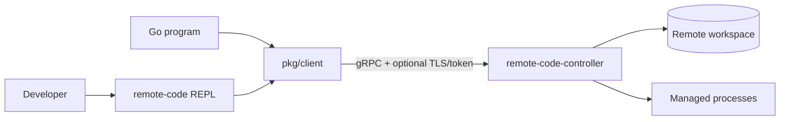

# Remote Code Client 功能介绍与使用指南

本文介绍 Remote Code 的客户端侧能力，包括面向人的交互式命令行 `remote-code`，以及面向 Go 程序的
公共包 `pkg/client`。内容覆盖连接、安全选项、完整 REPL 命令、典型工作流、断点续传和 SDK 接入，可直接
作为技术会议中 Client 部分的分享材料。

> 当前 Client 面向 `remote.code.v1` API。命令行已经实现工作区文件和通用受管进程控制；README 中的
> `context`、`agent start/list/stop` 等产品形态仍是后续规划，不是当前可执行命令。

## 1. Client 的组成与定位

客户端侧分为两层：

| 层次 | 入口 | 适用场景 |
| --- | --- | --- |
| 交互式 CLI | `cmd/remote-code` / `bin/remote-code` | 人工操作、演示、远程开发、诊断和 PTY 交互 |
| Go client | `github.com/qq1426155093/remote-code/pkg/client` | 自动化工具、服务集成和自定义 UI |

CLI 不是每次执行一个远程子命令的 one-shot 工具。它先建立一条长期 gRPC 连接，再进入带当前远端目录、
命令历史和 Tab 补全的 REPL。CLI 的文件、进程、日志和输入能力都通过公共 Go client 实现。



## 2. 构建与启动

### 2.1 构建

项目要求 Go 1.26。在仓库根目录运行：

```bash
make build
```

生成的客户端为：

```text
bin/remote-code
```

查看版本和全部启动选项：

```bash
./bin/remote-code --version
./bin/remote-code --help
```

### 2.2 启动参数

| 参数 | 默认值 | 说明 |
| --- | --- | --- |
| `--controller-addr` | `127.0.0.1:9443` | Controller 的 `host:port` |
| `--tls-ca` | 空 | 用于验证 Controller 的 CA 或服务器证书 PEM；空表示明文连接 |
| `--tls-server-name` | 空 | TLS server name 覆盖；证书名与连接地址不同时使用 |
| `--token-file` | 空 | bearer token 文件；读取后仅放入 gRPC metadata |
| `--transfer-state-dir` | 用户缓存目录 | 本地断点续传状态目录 |
| `--timeout` | `30s` | 普通 RPC 的单命令超时；`0` 表示不设命令超时 |
| `--cat-max-bytes` | `1048576` | `cat` 最多向终端输出的字节数，必须为正数 |
| `--version` | `false` | 输出版本后退出 |

即使 `--timeout 0`，初始连接仍有 30 秒上限，避免无法到达的地址永久阻塞。`attach` 和 `stdin`
使用独立长连接生命周期；持续时间较长的 `logs --follow` 建议以 `--timeout 0` 启动 Client，否则仍受普通
命令超时影响。

### 2.3 连接示例

本机明文连接：

```bash
./bin/remote-code --controller-addr 127.0.0.1:9443
```

远程 TLS + token 连接：

```bash
./bin/remote-code \
  --controller-addr devbox.example.com:9443 \
  --tls-ca ~/.config/remote-code/ca.pem \
  --token-file ~/.config/remote-code/devbox.token
```

证书中的 DNS 名与连接地址不一致时，可显式设置：

```bash
./bin/remote-code \
  --controller-addr 10.0.0.8:9443 \
  --tls-ca ~/.config/remote-code/ca.pem \
  --tls-server-name devbox.example.com \
  --token-file ~/.config/remote-code/devbox.token
```

Client 会把 `--tls-ca` 中的证书追加到系统根证书池，并要求 TLS 1.2 或更高版本。未配置 `--tls-ca` 时，
连接是明文的；即使使用 token，也只能在 loopback 或已有加密隧道内安全使用。

连接成功后输出类似：

```text
Connected to remote-code-controller v0.1.0 (API remote.code.v1, workspace workspace)
Type 'help' for available commands; press Tab for completion.
remote-code:/>
```

## 3. REPL 使用模型

### 3.1 帮助与补全

```text
help                    列出全部命令
help exec               显示某个命令的 usage
Tab                     补全命令、选项、远端路径、模板或进程名
clear                   清屏
exit / quit             关闭 Client；不会自动停止远端进程
```

命令行使用 shell 风格的引号和反斜杠解析，因此包含空格的路径可以写为：

```text
cat "docs/review notes.md"
upload './local notes.md' 'docs/remote notes.md'
```

解析只发生在本地 REPL。`exec` 会把解析后的 command 和每个 argument 分开传给 Controller，服务端不会
再经过 shell 展开、变量替换、管道或重定向。

### 3.2 远端当前目录

Client 维护一个仅存在于当前 REPL 会话中的远端 cwd：

```text
pwd
cd docs
cd ../configs
cd /
```

提示符中的 `/` 表示 Controller workspace 根目录，而不是远端机器的操作系统根目录。以 `/` 开头的路径
同样解释为 workspace 内的虚拟绝对路径。任何会越过 workspace 根的 `..` 都会在 Client 侧先被拒绝，
Controller 还会再次实施路径校验。

## 4. 命令总览

### 4.1 会话与发现

| 命令 | 功能 |
| --- | --- |
| `help [COMMAND]` | 列出命令或查看单个命令 usage |
| `info` | 查看 Controller/API 版本、workspace、传输能力、限制和模板数 |
| `pwd` | 显示当前远端目录 |
| `cd [REMOTE_DIR]` | 切换远端目录；无参数回到 workspace 根 |
| `clear` | 清空本地终端画面 |
| `exit`、`quit` | 退出 Client，不停止远端受管进程 |

### 4.2 文件命令

| 命令 | 功能 |
| --- | --- |
| `ls [-l] [REMOTE_PATH]` | 列目录或单个路径；`-l` 显示 mode、大小和修改时间 |
| `tree [REMOTE_PATH]` | 显示服务端返回的递归目录树 |
| `stat REMOTE_PATH` | 显示类型、大小、mode、修改时间和符号链接目标 |
| `cat REMOTE_FILE` | 下载并打印小文件，受 `--cat-max-bytes` 限制 |
| `upload LOCAL_FILE [REMOTE_FILE]` | 上传本地普通文件；省略目标时使用本地 basename |
| `download REMOTE_FILE [LOCAL_FILE]` | 下载远端文件；省略目标时使用远端 basename |
| `mkdir [-p] REMOTE_DIR` | 以 `0755` 创建目录；`-p` 同时创建父目录 |
| `rm [-r] REMOTE_PATH` | 删除文件或空目录；`-r` 递归删除 |
| `mv [-f] SOURCE DESTINATION` | 移动/重命名；`-f` 允许覆盖有效目标 |
| `chmod OCTAL_MODE REMOTE_PATH` | 设置 `0000`–`0777` 权限位 |

### 4.3 进程命令

| 命令 | 功能 |
| --- | --- |
| `exec ... CMD [ARG ...]` | 直接启动通用 PIPE 或 PTY 进程 |
| `templates [TEMPLATE]` | 列出模板，或显示一个模板的完整参数 Schema |
| `exec-template ... TEMPLATE` | 用 JSON 参数启动服务端模板 |
| `ps [-a]` | 列出活动进程；`-a` 包括退出、失败和丢失历史 |
| `kill [-s SIGNAL] [-w] PROCESS` | 向整个进程组发信号；默认 `TERM`，`-w` 等待终态 |
| `logs [-f] [-n LINES\|--offset OFFSET] [--stdout\|--stderr] PROCESS_ID` | 回放或跟随日志 |
| `controller-logs` / `clogs` `[-f] [-n LINES\|--offset OFFSET]` | 回放或跟随 Controller 自身的结构化运行事件 |
| `stdin PROCESS` | 进入逐行 managed-input 子模式 |
| `attach PROCESS` | 接入 PTY 的原始交互终端 |
| `forget PROCESS_OR_GLOB [...]` | 永久删除一个或多个终态进程的历史与日志 |

## 5. 文件操作详解

### 5.1 浏览与读取

```text
remote-code:/> ls
remote-code:/> ls -l docs
remote-code:/> tree docs
remote-code:/> stat docs/design.md
remote-code:/> cat docs/design.md
```

`ls` 对目录返回直接子项，对普通文件返回该文件本身。`tree` 的排序和递归结构由 Controller 生成，
Client 只负责渲染。符号链接显示为 `name -> target`，目录树不会递归跟随符号链接。

`cat` 仍走带大小和 SHA-256 校验的下载流程；达到本地显示上限时会停止并提示使用 `download`，避免意外把
大型或二进制文件写入终端。

### 5.2 上传与下载

```text
remote-code:/> mkdir -p docs/input
remote-code:/> upload ./requirements.md docs/input/requirements.md
remote-code:/> download docs/input/requirements.md ./requirements.copy.md
```

CLI 的 `upload` 会覆盖已存在的普通目标文件。上传过程中会计算完整 SHA-256，Controller 仅在大小和哈希
一致后原子发布。下载先写目标目录中的隐藏 `.part` 文件，校验完成并同步后再原子改名，因此失败不会留下
一个看似完整的最终文件。

连接时 Client 会从 `GetInfo.file_transfers` 协商能力：

- 新 Controller 支持时，`UploadFile` 和 `DownloadFile` 自动使用可恢复协议；
- 不支持或被服务端关闭时，自动回退到旧的流式 RPC；
- 可恢复传输对 `Unavailable`、`DeadlineExceeded`、`Aborted` 和 `Canceled` 等错误最多进行有界重试；
- 上传从服务端 durable offset 继续；下载校验 revision 和本地部分文件的前缀哈希；
- 本地文件、远端 revision 或传输参数变化时，旧状态会安全失效并重新开始。

默认状态目录为操作系统用户缓存目录下的 `remote-code/transfers`，Linux 通常是：

```text
~/.cache/remote-code/transfers/
```

也可以为会议演示、CI 或隔离环境显式指定：

```bash
./bin/remote-code \
  --controller-addr 127.0.0.1:9443 \
  --transfer-state-dir ./var/client-transfers
```

状态目录会被收紧为 `0700`，状态与锁文件使用不可预测的内容派生文件名。同一个本地/远端传输同时只能有
一个进程持有锁；遇到 `the same local file transfer is already active` 时，应先确认是否已有 Client 正在传输。

### 5.3 修改与删除

```text
remote-code:/> mkdir -p output/reports
remote-code:/> mv output/draft.md output/reports/final.md
remote-code:/> chmod 0640 output/reports/final.md
remote-code:/> rm output/reports/final.md
remote-code:/> rm -r output/reports
```

`rm -r`、覆盖移动和上传覆盖会改变远端数据，执行前应确认提示符中的 cwd 和目标路径。Client 不提供回收站；
删除成功后只能从版本控制、备份或其它副本恢复。

## 6. 进程操作详解

### 6.1 启动模型

完整语法：

```text
exec [--name NAME] [--pipe|--pty] [--stdin|--attach]
     [--cwd REMOTE_DIR] [-e KEY=VALUE ...] [--] CMD [ARG ...]
```

默认是 `PIPE + DISABLED input`。常见组合：

| 写法 | I/O | 输入 | 适用场景 |
| --- | --- | --- | --- |
| `exec CMD ...` | PIPE | DISABLED | 构建、测试、批处理 |
| `exec --stdin CMD ...` | PIPE | MANAGED | 后续逐行发送标准输入 |
| `exec --pty CMD ...` | PTY | DISABLED | 需要终端输出格式、但不需要后续输入 |
| `exec --attach CMD ...` | PTY | MANAGED | 启动后立即进入双向终端 |
| `exec --pty --stdin CMD ...` | PTY | MANAGED | 先后台启动，之后再 `attach` |

示例：

```text
remote-code:/> exec --name tests --cwd . -e LANG=C go test ./...
remote-code:/> exec --name builder --cwd project -- make build
remote-code:/> exec --name shell --attach /bin/bash
```

`--` 用于结束 Client 选项解析，尤其适合 command 自身以 `-` 开头或希望明确区分参数的场景。

Controller 不会解释 `|`、`>`、`$VAR`、glob 或 `&&`。确实需要 shell 语义时必须显式执行 shell：

```text
remote-code:/> exec --name pipeline -- /bin/sh -c 'go test ./... && go vet ./...'
```

这会主动扩大命令解释范围，不能用于拼接不可信输入。拥有 `exec` 权限的 token 本身已经具有以 Controller
系统用户身份运行通用代码的能力。

环境变量可以多次指定：

```text
remote-code:/> exec -e LANG=C -e CGO_ENABLED=0 --name build go build ./...
```

进程元数据只持久化环境变量名称，不持久化 value；但目标进程仍能读取 value，也可能自行把它写入输出。

### 6.2 进程引用

`kill`、`stdin`、`attach` 和精确 `forget` 接受以下引用：

```text
id:7aa5daab-e886-4889-9ec3-92d461883091
name:builder
pid:12345
7aa5daab-e886-4889-9ec3-92d461883091
builder
12345
```

没有前缀时，正整数按 PID、UUID 按 ID，其它值按逻辑名称解析。名称与 ID 看起来容易混淆时，建议使用
显式前缀。`logs` 当前例外：它要求完整进程 UUID，不接受名称或 PID。

### 6.3 查看状态与发信号

```text
remote-code:/> ps
remote-code:/> ps -a
remote-code:/> kill builder
remote-code:/> kill -s INT name:builder
remote-code:/> kill -s TERM -w id:7aa5daab-e886-4889-9ec3-92d461883091
```

`ps` 默认只显示 `STARTING`/`RUNNING` 活动进程。`ps -a` 还包括：

- `EXITED`：命令正常被回收，记录退出码或信号；
- `FAILED`：executable 未能成功启动或启动事务失败；
- `LOST`：Controller 重启前没有记录到进程退出，当前服务不会重新托管旧 PID。

`kill` 默认发送 `TERM`。可用信号为 `HUP`、`INT`、`QUIT`、`TERM`、`KILL`、`USR1`、`USR2`、
`STOP` 和 `CONT`，也接受 `SIGTERM` 等写法及受支持的数字。信号发送给整个受管进程组。

### 6.4 日志回放与跟随

```text
remote-code:/> logs -n 100 7aa5daab-e886-4889-9ec3-92d461883091
remote-code:/> logs --stdout --offset 500 7aa5daab-e886-4889-9ec3-92d461883091
remote-code:/> logs --stderr --follow 7aa5daab-e886-4889-9ec3-92d461883091
```

规则如下：

- `-n`/`--tail` 与 `--offset` 互斥；
- 不指定 stdout/stderr 时返回两者；PTY 输出统一视为 stdout；
- `--offset` 是逻辑记录 offset，不是文件字节位置；
- `--follow` 先回放选定范围，再持续输出；
- follow 中按 `Ctrl-C` 只停止当前观察，不会终止远端进程；
- 默认 `--timeout 30s` 仍适用于 follow，长期观察请使用 `--timeout 0` 启动 Client。

Controller 自身日志使用独立命令：

```text
remote-code:/> controller-logs -n 100
remote-code:/> clogs --offset 500 --follow
```

它输出一行一个 JSON 事件，包含 `offset`、`next_offset`、`boot_id`、时间、级别、组件、事件名和脱敏字段。offset 是
Controller 日志的逻辑续读游标，与进程日志互不相同；服务重启后旧事件仍可回放，entry 会保留其原始 boot ID。
`Ctrl-C` 只取消当前 follow。若历史已回收，服务端返回 `OUT_OF_RANGE`，应使用错误详情中的 earliest offset 或
重新指定 tail。

### 6.5 逐行输入子模式

先以 managed input 启动：

```text
remote-code:/> exec --name reader --pipe --stdin cat
remote-code:/> stdin reader
```

进入子模式后，普通行会追加换行并发送给进程。特殊命令：

| 输入 | 行为 |
| --- | --- |
| `.detach` | 释放当前 writer，保持远端输入打开 |
| `.eof` | 永久关闭 PIPE stdin；PTY 不支持独立关闭写侧 |
| `.eot` | 发送字节 `0x04`，即传统终端的 Ctrl-D |
| `Ctrl-C` 或本地 EOF | 执行非破坏性 detach |

同一进程同时只能有一个输入 writer。如果另一 Client 已经 `stdin` 或 `attach`，新的连接会收到前置条件错误。

### 6.6 PTY attach

```text
remote-code:/> exec --name editor --attach vim notes.md
```

或先后台启动再接入：

```text
remote-code:/> exec --name shell --pty --stdin /bin/bash
remote-code:/> attach shell
```

attach 会：

- 获取独占的 managed-input writer；
- 回放保留的 PTY 历史，再无缝 follow 实时输出；
- 把本地终端切换到 raw mode；
- 监听本地窗口变化并按顺序发送 resize；
- 使用本地 alternate screen，退出时恢复终端。

控制序列：

```text
Ctrl-] d          detach，远端进程继续运行
Ctrl-] Ctrl-]     向远端发送一个字面量 Ctrl-]
```

网络断开与 detach 都不会停止进程。重新运行 `attach NAME` 可再次接入，并回放当前仍被保留的历史。完整
raw terminal 体验当前以 Linux 客户端为目标；不支持的本地平台会明确拒绝 attach。

### 6.7 删除进程历史

```text
remote-code:/> forget builder
remote-code:/> forget id:7aa5daab-e886-4889-9ec3-92d461883091
remote-code:/> forget 'test-*' glob:reused-name
```

没有前缀但包含 `*`、`?` 或 `[` 的值自动按名称 glob 解析；也可用 `glob:` 显式声明。服务端按 UUID 去重，
逐个返回成功或失败。只有终态记录可以删除；活动进程必须先退出。删除会永久移除 metadata、status 和日志，
不可恢复。

## 7. 进程模板

列出模板摘要：

```text
remote-code:/> templates
```

查看模板完整 revision 和参数 JSON Schema：

```text
remote-code:/> templates code-agent
```

启动模板：

```text
remote-code:/> exec-template --name reviewer --params '{"model":"gpt-5","prompt":"Review the change","working_directory":"."}' code-agent
```

也可以使用最多 1 MiB 的本地 JSON object 文件：

```text
remote-code:/> exec-template --params-file ./agent-parameters.json code-agent
```

参数缺省为 `{}`，最终必须通过服务端模板的 JSON Schema。`--params` 与 `--params-file` 互斥。

对 PTY + MANAGED 模板可以直接接入：

```text
remote-code:/> exec-template --attach --params-file ./agent-parameters.json code-agent
```

`--attach` 会先获取模板摘要，确认 I/O/输入模式，记录当前完整 revision，再携带 expected revision 启动。
如果两次调用间模板发生变化，服务端返回前置条件错误，防止按旧 Schema 启动新模板。CLI 不打印动态 parameters
或模板渲染后的完整 argv。

## 8. 典型工作流

### 8.1 上传输入、运行构建、下载产物

```text
remote-code:/> mkdir -p jobs/demo
remote-code:/> upload ./requirements.md jobs/demo/requirements.md
remote-code:/> exec --name build --cwd jobs/demo -- /usr/local/bin/build-tool requirements.md
remote-code:/> ps
remote-code:/> logs --follow <BUILD_UUID>
remote-code:/> download jobs/demo/output/report.md ./report.md
```

### 8.2 后台运行并稍后继续观察

```text
remote-code:/> exec --name tests --cwd project go test ./...
remote-code:/> ps
remote-code:/> exit

# 稍后重新连接
remote-code:/> ps -a
remote-code:/> logs -n 200 <TEST_UUID>
```

关闭本地 Client 不影响远端进程；只要 Controller 仍运行，任务会继续并持续记录日志。

### 8.3 交互式远程终端

```text
remote-code:/> exec --name debug-shell --attach /bin/bash
# 在远端 shell 中工作
# Ctrl-] d 返回 REPL
remote-code:/> ps
remote-code:/> attach debug-shell
remote-code:/> kill -s TERM -w debug-shell
```

### 8.4 技术会议演示脚本

```text
info
mkdir -p demo/input
upload ./README.md demo/input/README.md
tree demo
exec --name demo-log -- /bin/sh -c 'for i in 1 2 3; do echo step-$i; sleep 1; done'
ps
logs --follow <DEMO_LOG_UUID>
exec --name demo-shell --attach /bin/bash
# Ctrl-] d
attach demo-shell
kill -s TERM -w demo-shell
ps -a
```

演示前应先准备好 UUID 的复制方式，并以 `--timeout 0` 启动 Client，避免日志 follow 在讲解中到达默认超时。

## 9. Go Client 接入

### 9.1 创建连接

公共包使用调用方提供的 context 完成首次 `GetInfo` 验证：

```go
package main

import (
	"context"
	"log"
	"os"
	"strings"
	"time"

	remoteclient "github.com/qq1426155093/remote-code/pkg/client"
)

func main() {
	tokenBytes, err := os.ReadFile("/secure/path/devbox.token")
	if err != nil {
		log.Fatal(err)
	}

	ctx, cancel := context.WithTimeout(context.Background(), 10*time.Second)
	defer cancel()

	client, err := remoteclient.New(ctx, remoteclient.Config{
		Address:                "devbox.example.com:9443",
		TLSCAFile:              "/secure/path/ca.pem",
		TLSServerName:          "devbox.example.com",
		Token:                  strings.TrimSpace(string(tokenBytes)),
		TransferStateDirectory: "/var/lib/my-tool/remote-code-transfers",
	})
	if err != nil {
		log.Fatal(err)
	}
	defer client.Close()

	log.Printf("connected to API %s", client.Info().GetApiVersion())
}
```

应用不应把 token 写入日志、命令行参数或错误文本。每个业务操作都应传入有界 context；长日志流和 attach
应使用可主动取消的 context。

### 9.2 API 分类

| 分类 | 主要方法 |
| --- | --- |
| 发现 | `Info`、`GetInfo` |
| 文件读取 | `Stat`、`List`、`Tree`、`Download`、`DownloadFile` |
| 文件修改 | `Upload`、`UploadFile`、`Mkdir`、`Move`、`Remove`、`Chmod` |
| 进程模板 | `ListProcessTemplates`、`GetProcessTemplate`、`StartProcessFromTemplate` |
| 进程生命周期 | `StartProcess`、`StartProcessWithOptions`、`ListProcesses`、`SignalProcess` |
| 历史删除 | `DeleteProcess`、`BatchDeleteProcesses`、`ExactProcessSelector`、`ProcessNameGlobSelector` |
| 日志 | `ObserveProcessLogs`、`ObserveControllerLogs` |
| 输入 | `OpenProcessInput`、`ProcessInputSession` |
| 交互终端 | `OpenProcessAttachment`、`ProcessAttachment` |

### 9.3 文件示例

```go
operationCtx, operationCancel := context.WithTimeout(context.Background(), 2*time.Minute)
defer operationCancel()

uploaded, err := client.UploadFile(operationCtx, "./requirements.md", "docs/requirements.md", true)
if err != nil {
	log.Fatal(err)
}
fmt.Printf("uploaded %d bytes\n", uploaded.GetSize())

downloaded, err := client.DownloadFile(operationCtx, "output/report.md", "./report.md")
if err != nil {
	log.Fatal(err)
}
fmt.Printf("downloaded %d bytes, sha256=%x\n", downloaded.Size, downloaded.SHA256)
```

`UploadFile`/`DownloadFile` 可以 seek 本地文件，因此会协商可恢复协议。通用 `Upload` 接受 caller 提供的
reader、大小、mode 和 digest；通用 `Download` 写入 caller 提供的 writer，这两种流式接口使用兼容 RPC，
不会在任意 writer/reader 上假设可恢复能力。

### 9.4 启动和观察进程

```go
processCtx, processCancel := context.WithCancel(context.Background())
defer processCancel()

info, err := client.StartProcessWithOptions(processCtx, remoteclient.ProcessStartOptions{
	Name:             "tests",
	Command:          "go",
	Arguments:        []string{"test", "./..."},
	WorkingDirectory: ".",
	IOMode:           codev1.ProcessIOMode_PROCESS_IO_MODE_PIPE,
	InputMode:        codev1.ProcessInputMode_PROCESS_INPUT_MODE_DISABLED,
	Environment:      map[string]string{"LANG": "C"},
})
if err != nil {
	log.Fatal(err)
}

tail := uint64(100)
stream, err := client.ObserveProcessLogs(processCtx, info.GetId(), remoteclient.ProcessLogOptions{
	TailLines: &tail,
	Follow:    true,
})
if err != nil {
	log.Fatal(err)
}

for {
	response, err := stream.Recv()
	if errors.Is(err, io.EOF) {
		break
	}
	if err != nil {
		log.Fatal(err)
	}
	if chunk := response.GetChunk(); chunk != nil {
		if _, err := os.Stdout.Write(chunk.GetData()); err != nil {
			log.Fatal(err)
		}
	}
}
```

若把文件和进程片段接入前面的示例程序，还需补充以下 import（`os` 和 `remoteclient` 已在前例中导入）：

```go
import (
	"errors"
	"fmt"
	"io"

	codev1 "github.com/qq1426155093/remote-code/api/remote/code/v1"
)
```

生产代码应读取日志 stream 的 header、checkpoint 和 end frame，并持久化 `NextOffset`，以便断线后按逻辑
offset 继续，而不重复处理已经确认的记录。

公共 Go client 通过 `ObserveControllerLogs(ctx, ControllerLogOptions{...})` 暴露 Controller 日志。选项中的
`Offset`、`TailLines` 互斥，`Follow` 控制是否等待新事件；返回流的 `Header` 先公布当前 boot/保留边界，
随后读取 `Entry` 并在 `Checkpoint.NextOffset` 成功处理后保存游标。不要把 entry 的 `boot_id` 当作 offset，
它只用于区分跨重启的事件来源。

### 9.5 输入和 attach API

`OpenProcessInput` 返回一个独占 `ProcessInputSession`：

| 方法 | 语义 |
| --- | --- |
| `Process()` | 返回打开 session 时的进程快照 |
| `Write([]byte)` | 按 64 KiB 分块发送并逐块等待有序 ack |
| `Resize(rows, columns)` | 对 PTY 发送有序 resize 并等待 ack |
| `CloseInput()` | 永久关闭 PIPE stdin |
| `Detach()` / `Close()` | 释放 writer，但保持远端输入打开 |

`OpenProcessAttachment` 组合输入和日志两个既有 RPC，返回 `ProcessAttachment`：

| 方法 | 语义 |
| --- | --- |
| `Output()` | 接收精确 PTY 输出字节；调用方必须持续消费以避免背压 |
| `Write([]byte)` | 有界流水线发送输入 |
| `Resize(rows, columns)` | 与输入共享顺序的窗口调整 |
| `Offset()` | 返回最新日志 checkpoint，可用于续读 |
| `Done()` / `Wait()` | 等待任一底层 stream 结束并取得结果 |
| `Detach()` / `Close()` | 非破坏性释放 attachment |

默认 attachment 最多回放 100,000 条逻辑行。`ProcessAttachOptions.TailLines` 设为 `0` 可从当前边界开始、
不回放历史；设为其它值可控制回放量。

## 10. 错误处理与兼容性

CLI 会把 gRPC status 显示为：

```text
error: <message> (<CODE>)
```

常见 code：

| Code | 常见含义 |
| --- | --- |
| `UNAUTHENTICATED` | bearer token 缺失或不一致 |
| `INVALID_ARGUMENT` | 路径、mode、模板参数、信号或进程选项无效 |
| `NOT_FOUND` | 文件、进程、模板或上传 session 不存在 |
| `ALREADY_EXISTS` | 目标文件或活动进程名称已存在 |
| `FAILED_PRECONDITION` | 进程状态不允许操作、writer 被占用、模板 revision 变化或文件 revision 变化 |
| `RESOURCE_EXHAUSTED` | 上传、日志、树、进程数、观察者或并发上限已达到 |
| `OUT_OF_RANGE` | 请求日志 offset 已不在保留区间 |
| `UNAVAILABLE` | Controller 不可达、正在关闭或传输暂时中断 |
| `DEADLINE_EXCEEDED` | 本地命令 context 达到 `--timeout` |
| `DATA_LOSS` | 哈希、大小、日志记录或响应结构校验失败 |

Client 在连接时读取能力，而不是只根据版本字符串猜测功能。可恢复传输能自动回退；新代码仍应检查
`client.Info()` 中的 API 与 capability，并对新增服务端限制做显式处理。

## 11. 常见问题排查

| 现象 | 可能原因 | 处理方式 |
| --- | --- | --- |
| `connect to controller: ... connection refused` | 地址错误、服务未启动或端口被防火墙拦截 | 核对 Controller 启动日志和 `--controller-addr` |
| TLS `certificate signed by unknown authority` | `--tls-ca` 不包含签发链 | 使用正确 CA/服务器证书 PEM |
| TLS hostname mismatch | 连接 IP 与证书 DNS 名不同 | 使用证书名连接，或设置 `--tls-server-name` |
| `valid bearer token required` | Client 未传 token 或文件内容不同 | 核对 token 文件，不要把 token 直接贴入命令 |
| `context deadline exceeded` | 默认 30 秒不适合当前操作 | 调大 `--timeout`；长期 follow 可设为 `0` |
| `cat output exceeds ...` | 文件超过显示上限 | 使用 `download`，或谨慎调大 `--cat-max-bytes` |
| `remote path cannot go above workspace root` | cwd 与 `..` 组合越界 | 使用 `pwd` 确认位置，并改用 workspace 内路径 |
| `interactive attachment requires a PTY process` | 目标用 PIPE 启动 | 使用 `--attach`，或 `--pty --stdin` 重新启动 |
| `process input ... already attached` | 另一 Client 持有独占 writer | 在原会话 detach，或等待其断开 |
| follow 约 30 秒后结束 | 默认命令 timeout 生效 | 以 `--timeout 0` 重新启动 Client |
| 日志 offset 不可用 | 旧 segment 已按容量/保留期回收 | 从服务端报告的 earliest offset 或 tail 重新读取 |
| 下载/上传提示同一传输已活动 | 本地状态锁被另一进程持有 | 确认其它 Client；异常退出后锁会随文件描述符释放 |
| `forget` 部分成功、部分失败 | selector 混合命中活动/终态/不存在记录 | 查看逐项错误，先终止活动进程再重试 |

## 12. 技术会议分享建议

Client 部分建议围绕“一个长期连接里的四类操作”展开：

1. 连接与能力协商：展示 TLS/token 参数和 `info`；
2. 文件闭环：`upload -> tree/stat -> download`，说明原子校验与断点续传；
3. 非交互任务：`exec -> ps -> logs --follow`，说明进程与 Client 解耦；
4. 交互任务：`exec --attach -> detach -> attach`，说明双流组合和 PTY resize；
5. 模板：`templates -> exec-template`，说明 Schema、revision 和参数脱敏；
6. 自动化：展示 `pkg/client` 的连接、文件和进程 typed API；
7. 最后强调三个易错点：`logs` 使用 UUID、长期 follow 需调整 timeout、`forget` 不可恢复。

Controller 的部署、配置、持久化和安全边界见
[Controller 功能介绍与使用指南](controller-guide.md)。
