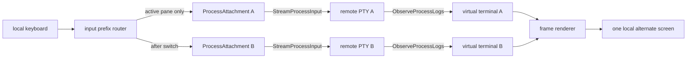

# Client 多窗口交互详细设计 v1

## 1. 背景、目标与边界

Remote Code 已经能够通过 `ProcessAttachment` 同时组合进程输入流和输出日志流，但当前
`attach PROCESS` 一次只占用整个本地终端显示一个 PTY。当多个 code agent 并行运行时，用户需要在
同一个屏幕中持续观察全部 agent，并把键盘输入准确发送给选中的 agent。

本设计在 `remote-code` REPL 中增加本地终端复用器：

- 一个备用屏幕内平铺多个远端 PTY；
- 所有窗格持续接收、解析和显示各自的运行输出；
- 任意时刻只有一个活动窗格接收用户输入；
- 运行期间可以打开窗格、关闭窗格、按顺序或编号切换窗格；
- 关闭窗格或退出复用器只执行 detach，不发送 signal，也不终止远端进程；
- 进程退出后保留最后一屏，直到用户关闭对应窗格。

本版本只支持以 `MANAGED` 输入启动的 PTY 进程。PIPE 没有可平铺的终端屏幕，`DISABLED` 输入也不能
获得 writer，因此二者继续使用 `logs`、`stdin` 等现有命令。多窗口属于 CLI 本地能力，不新增 protobuf、
RPC、controller 状态或持久化数据，也不改变单进程 `attach` 的行为。

## 2. 用户接口

### 2.1 REPL 命令

```text
windows | mux [-n TAIL_LINES] [PROCESS ...]
```

`PROCESS` 接受与 `attach` 相同的名称、UUID、PID 以及显式的 `name:`、`id:`、`pid:` 引用。可以在进入
界面时一次打开多个进程，也可以不传进程，进入空白界面后再打开。

`-n` 是每个新 attachment 回放的历史逻辑行数：

- 默认 `2000`，兼顾上下文恢复与打开速度；
- `0` 表示从当前日志边界开始，只显示新输出；
- 有效范围 `0..100000`，与服务端日志 tail 上限一致；
- 在同一次多窗口会话中，初始窗格和之后打开的窗格使用同一个值。

本版本最多同时保留 9 个窗格。这个限制使编号切换保持单键操作，也限制并发日志 observer、输入 stream
和本地终端模拟器的资源占用。达到上限时打开操作只在状态栏报错，不影响已有窗格。

### 2.2 键盘模型

正常状态下，键盘字节原样发送给活动窗格。`Ctrl-]` 是本地命令前缀：

| 按键 | 行为 |
| --- | --- |
| `Ctrl-] o` | 在状态栏打开进程引用输入框 |
| `Ctrl-] x` | 关闭并 detach 当前窗格 |
| `Ctrl-] n` / `Ctrl-] p` | 切换到下一个 / 上一个窗格，首尾循环 |
| `Ctrl-] 1` .. `Ctrl-] 9` | 按屏幕标题中的编号直接切换 |
| `Ctrl-] ?` | 显示或隐藏快捷键帮助 |
| `Ctrl-] q` / `Ctrl-] d` | detach 全部窗格并返回 REPL |
| `Ctrl-] Ctrl-]` | 向活动进程发送一个字面量 `Ctrl-]` |

未知的前缀组合不会吞掉输入，而是把 `Ctrl-]` 和后续字节一起发给活动进程。前缀可以跨本地 read 分片，
保证网络或终端读取边界不改变语义。

打开输入框期间，键盘不会发给远端进程：

- `Enter` 解析并异步打开引用；
- `Esc` 或 `Ctrl-C` 取消；
- `Backspace` 按 UTF-8 rune 删除；
- `Ctrl-U` 清空；
- 输入最多 256 bytes，控制字符不会进入引用。

### 2.3 屏幕

屏幕由窗格区和最底部一行状态栏组成。每个窗格包含标题边框和虚拟终端内容：

```text
+-[1] designer (running)----------+ +-[2] implementer (running)-------+
|                                 | |                                 |
| agent output                    | | agent output                    |
|                                 | |                                 |
+---------------------------------+ +---------------------------------+
 Ctrl-] ?: help | active: 2 implementer
```

活动窗格使用高亮标题并显示真实光标位置；非活动窗格继续刷新但不接收键盘。attachment 正常结束或失败后，
标题显示 `done` 或 `error`，内容保留。状态栏显示活动窗格、打开进度、最近一次本地命令结果或错误；错误
不会写入进程输出区。

终端最小尺寸为 20 列 x 6 行。窗格数量或本地尺寸变化时重新计算等分网格，并将每个内容矩形的新行列数
发送到对应远端 PTY。布局优先选择接近普通终端宽高比、空槽较少且满足最小内容尺寸的行列组合；不能
同时满足时仍保持每个矩形在屏幕边界内，并在状态栏提示终端过小。

## 3. 复用现有协议

每个窗格对应一个现有 `pkg/client.ProcessAttachment`：



每个打开请求先获得单调递增的本地顺序号。`OpenProcessAttachment` 仍负责先获得独占 input writer 和稳定
UUID，再以 `follow=true` 打开 PTY stdout observer；即使多个异步请求的网络完成顺序不同，事件循环也按
请求顺序插入窗格，较早请求的迟到结果不会抢走较新窗格的焦点。服务端继续负责引用消歧、进程状态、
PTY/MANAGED 前置条件以及单进程 writer 互斥。多窗口只允许同一稳定 UUID 出现一次；如果两个不同引用解析
到同一进程，后打开的 attachment 会立即 detach。

多窗口不会把多个输出流直接写入真实终端。每个输出流先写入自己的虚拟终端网格，避免一个进程的
`clear screen`、光标移动、备用屏幕或 SGR 序列破坏其他窗格和 Client 状态。虚拟终端产生的设备状态、
光标位置等 reply 会回送到对应 attachment，而不会泄漏给其他进程。

## 4. Client 内部结构

实现位于 `internal/cli`，公共 Go client 的流契约保持不变：

| 文件 | 职责 |
| --- | --- |
| `multi_window.go` | 命令解析、会话事件循环、窗格生命周期和 attachment 路由 |
| `multi_window_input.go` | `Ctrl-]` 前缀状态机和打开输入框编辑 |
| `multi_window_layout.go` | 网格布局、frame/status/help 渲染和远端尺寸计算 |
| `terminal_emulator.go` | 虚拟终端的小接口及 `x/vt` 适配器 |
| `multi_window_test.go` | 参数、输入、布局、渲染和生命周期相关单元测试 |

核心对象如下：

```go
type processWindowManager struct {
    ctx        context.Context
    cancel     context.CancelFunc
    panes      []*processWindowPane
    active     int
    opening    int
    rows       int
    columns    int
    tailLines  uint64
    input      multiWindowInput
    events     chan processWindowEvent
}

type processWindowPane struct {
    id         uint64
    order      uint64
    process    *codev1.ProcessInfo
    attachment processWindowAttachment
    terminal   processWindowTerminal
    rectangle  windowRectangle
    state      paneState
}
```

attachment 和虚拟终端都通过窄接口注入。生产实现分别适配 `ProcessAttachment` 和固定版本的 `x/vt`；测试
使用确定性 fake，不需要 controller、网络或 code agent 凭据。

## 5. 并发与事件顺序

一个会话事件循环独占以下可变状态：窗格 slice、活动下标、布局、输入状态机和全部虚拟终端写入。这样
渲染永远观察到一致 frame，也不需要在布局与 emulator 之间增加交叉锁。

每个 attachment 使用三个轻量后台方向：

1. 输出 pump 顺序读取 `attachment.Output()`，复制 chunk 后投递到会话事件队列；channel 关闭后调用
   `Wait()` 并投递结束事件；
2. terminal reply pump 阻塞读取虚拟终端 reply pipe，并把 reply 投递回事件循环，再由事件循环写入对应
   窗格的有界 operation queue；
3. operation pump 是该窗格唯一的 input/resize 调用者，按 queue 顺序调用 `Write` 或 `Resize`。

本地 terminal reader 和 `SIGWINCH` watcher 也只投递事件。打开 attachment 在独立 goroutine 中执行，
因此 DNS、网络或服务端引用解析不会冻结其他窗格。打开完成事件携带请求顺序号和稳定进程信息；事件循环
检查会话是否仍存在、窗格上限和 UUID 去重后才按顺序接纳它。

用户输入与虚拟终端 reply 都由事件循环按序放入同一个窗格 operation queue，operation pump 再调用
`ProcessAttachment.Write`，因此单窗格内顺序确定。queue 满时事件循环等待空位，把背压传到本地 terminal
reader，而不是丢弃输入。`ProcessAttachment` 自身最多允许 32 个未确认操作，继续承担有限网络背压。
会话事件队列也是有界的；当渲染暂时落后时，输出 pump 逐级反压到 gRPC stream，不建立无界内存队列。

输出到达只标记 frame 为 dirty。渲染 timer 把刷新频率限制在最多约 30 FPS，并把完整 frame 组装成一次
本地 write，避免高速 agent 输出导致每个 chunk 都重绘全屏。输入、resize、attachment 结束和本地命令
仍立即改变内存状态，并在下一个 frame 可见。

## 6. 布局、终端模拟与渲染

可用高度是 `localRows - 1`，最后一行保留给状态。对候选列数 `1..paneCount` 计算
`rows = ceil(paneCount / columns)`，以以下因素组成确定性的加权分数并选择最低者：

1. 不能提供至少 2 列 x 1 行内容的候选受到足够大的惩罚；
2. tile 宽高比与目标终端宽高比的对数距离；
3. 未使用网格槽数量的小幅惩罚。

总宽度和高度用商与余数分配，前面的行/列各多一个 cell，保证矩形无重叠、无缝隙且不越界。窗格边框各
占一 cell，因此传给 PTY 和虚拟终端的是 `tileWidth - 2`、`tileHeight - 2`。

每次布局变化执行：

1. resize 对应虚拟终端网格；
2. 向活动中的远端 attachment 发送相同行列；
3. 新 attachment 再发送一次临时相邻尺寸和真实尺寸，强制已运行的全屏程序收到 `SIGWINCH` 并重绘。

虚拟终端使用精确 pseudo-version
`github.com/charmbracelet/x/vt@v0.0.0-20260816001655-68d539dca504`。该依赖目前没有稳定版本承诺，因此：

- `go.mod`/`go.sum` 固定完整版本和校验和；
- 业务代码只依赖 `processWindowTerminal` 小接口；
- 不向公共 API 暴露 `x/vt` 类型；
- 升级必须运行输入、ANSI、resize 和 race 测试。

frame renderer 使用绝对光标定位，在本地备用屏幕中关闭自动换行、隐藏光标、清理每个目标区域后写入
虚拟终端的已解析 cell 渲染结果。最终只在普通交互状态显示活动窗格的映射光标；打开输入框或帮助状态
隐藏它。退出路径总是恢复 SGR、光标、自动换行、原屏幕和原 termios。

## 7. 生命周期与失败语义

窗格状态为：

```text
OPENING -> ACTIVE -> DONE
                  -> ERROR
ACTIVE/DONE/ERROR -> CLOSING -> REMOVED
```

- `OPENING` 只计数并显示在状态栏，不创建空 pane；
- `ACTIVE` 表示 attachment 两条流仍工作，不等于当前键盘焦点；
- 进程退出导致正常 `DONE`，传输或协议失败导致 `ERROR`；二者都保留最后 frame；
- `x` 从布局中立即移除 pane，停止本地 operation、关闭 emulator reply pipe，并异步 detach attachment；
- 删除活动 pane 后，焦点落到原位置的下一 pane；末尾删除则落到新的末尾；
- 关闭或退出时先发送显式 detach 并等待，再取消 attachment 的父 RPC context；detach 超过 3 秒时由父
  context 取消作为有界回退，避免清理永久阻塞；
- 退出会话时关闭所有 emulator、并发 detach/等待已有 attachment，再取消尚未完成的打开请求和会话
  context；事件队列中未接纳的打开结果也会被 detach；
- 本地输入 EOF、terminal read 错误、frame write 错误和 panic-free cleanup 都走同一恢复路径。

关闭窗格、退出复用器、网络中断都不调用 `SignalProcess` 或 `DeleteProcess`。如果显式 detach 帧未能送达，
gRPC context 取消仍会触发服务端 writer 释放语义，远端进程继续运行。

## 8. 错误与可观测性

打开失败按 gRPC code 和 message 显示在本地状态栏，例如进程不存在、不是 PTY、输入未启用、进程已退出
或 writer 已被其他 client 占用。一个窗格失败不会结束其他窗格。

以下错误结束整个多窗口会话并返回 REPL 的普通错误打印路径：

- 本地终端不受支持或尺寸无效；
- 无法进入/恢复 raw mode 或备用屏幕；
- 真实终端读取、resize 查询或 frame 写入失败。

单个 attachment 的输出、输入或协议错误只把对应 pane 标为 `ERROR`。状态栏内容在显示前去除控制字符并
按终端显示宽度截断，避免服务端名称或错误文本注入本地 ANSI 序列。

## 9. 安全与隐私

- 输入 payload、远端输出、prompt 和 token 不写 Client 日志或新的本地文件；
- 多窗口只渲染已有日志内容，不改变 controller 的持久化策略；
- 远端 OSC/DCS/CSI 先进入虚拟终端，不能直接控制 Client 的全局备用屏幕；
- 标题和状态栏只使用经过控制字符清理的进程名称与错误摘要；
- 虚拟终端 grid 与有界事件 channel 是会话内存，退出后释放；
- open 操作仍使用服务端 `ProcessReference` 解析，不引入 shell、路径或命令解释；
- detach 是唯一的窗口关闭动作，避免误杀长时间运行的 agent。

## 10. 测试与验收

单元测试至少覆盖：

- `-n` 边界、引用解析、窗格上限；
- 前缀跨 chunk、字面量前缀、未知组合、切换/关闭/退出命令；
- 打开输入框的 UTF-8 backspace、取消、清空、长度限制和 CRLF；
- 1..9 个 pane 在多种终端尺寸下无重叠、不越界、内容尺寸为正；
- 活动 pane 切换、关闭后的焦点选择、异步打开保持请求顺序、重复 UUID 拒绝；
- ANSI 光标移动和全屏清理只改变所属 emulator；
- frame 标题/状态控制字符清理和宽度截断；
- resize 同时更新 emulator 和远端 PTY；
- attachment 正常结束保留画面，错误只隔离到单 pane；
- cleanup 不发送 signal，显式 detach 发生在父 context 取消前，所有 goroutine 可由 context/Close 退出。

仓库级验收命令：

```bash
gofmt -w .
go test ./...
go test -race ./...
go vet ./...
go build ./...
```

手工验收建议启动至少三个名称不同的长时间 PTY agent，验证并行输出、交替输入、Vim/全屏程序 redraw、
本地终端 resize、窗格关闭后重新 attach，以及退出 `windows` 后所有远端进程仍处于 RUNNING。

## 11. 后续扩展

v1 不包含鼠标选窗、拖拽 resize、持久化布局、跨 controller 窗格、窗格内 scrollback 浏览或广播输入。
这些能力可以继续建立在稳定 UUID、独立 emulator 和单事件循环上，但广播输入必须设计显式确认，避免把
敏感 prompt 或破坏性命令意外发送给多个 agent。
