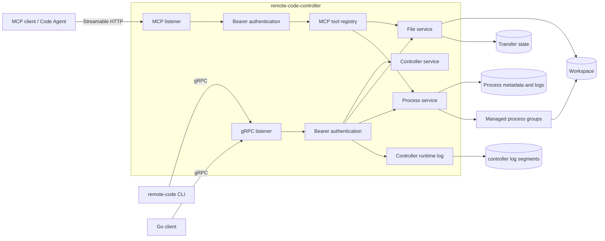

# Remote Code Controller 功能介绍与使用指南

本文面向负责部署、运维和评审 Remote Code 的开发者，介绍 `remote-code-controller`
已经实现的能力、运行模型、配置方式和安全边界。内容可直接作为技术会议中 Controller
部分的分享提纲，也可作为部署手册使用。

> 当前版本为 `0.1.0`，API 兼容线为 `remote.code.v1`。本文只把仓库中已经实现并有测试覆盖的能力
> 描述为可用功能；面向 Claude Code 的 Agent 身份、角色和编排语义仍是后续规划。

## 1. Controller 的定位

Controller 是部署在远程开发机上的长期运行服务，也是远程工作区的唯一网络入口。它向受认证客户端
提供 gRPC API，并可选地提供独立的 Streamable HTTP MCP endpoint，统一完成以下工作：

- 将全部文件操作约束在一个指定的 workspace 中；
- 启动、记录、观察和终止通用受管进程；
- 为 PIPE 与 PTY 进程保留可回放日志和可重连输入；
- 通过服务端模板固化 Code Agent 等复杂进程的启动约束；
- 对传输大小、活动进程、日志、MCP 调用和并发连接实施资源限制；
- 在进程退出或 Controller 重启后保留必要的历史记录。
- 将 Controller 自身的生命周期、进程服务和 MCP 诊断写入独立的持久化事件日志，并提供 gRPC 回放/follow。

当前能力边界如下：

| 能力 | 状态 | 说明 |
| --- | --- | --- |
| 工作区文件管理 | 已实现 | 浏览、上传、下载、建目录、移动、删除、权限修改和结构化目录树 |
| 断点续传 | 已实现 | 可恢复上传 session、带 revision 的范围下载、完整 SHA-256 校验和原子发布 |
| 通用进程管理 | 已实现 | PIPE/PTY、输入管理、进程组信号、日志、历史和重启恢复 |
| 进程模板 | 已实现 | JSON Schema 参数校验、受限 Expr 渲染、启动参数脱敏 |
| MCP Server | 已实现，默认关闭 | 从严格 `.mcp.yaml` 加载工具，并复用 Controller 内部服务 |
| Agent 角色与编排 | 尚未实现 | 设计稿中的 `designer`、`implementer`、`reviewer` 等仍属于产品规划 |
| 操作系统沙箱 | 不提供 | workspace 边界不能替代容器、虚拟机或受限系统用户 |

## 2. 总体架构



gRPC 与 MCP 使用不同 listener。默认情况下，gRPC 监听 `127.0.0.1:9443`，MCP 监听
`127.0.0.1:9444` 且保持关闭。TLS 和 bearer token 是两个入口共享的全局安全配置。

Controller 内部的主要组件如下：

| 组件 | 职责 |
| --- | --- |
| `ControllerService` | 返回版本、API、workspace、文件传输能力、进程上限、模板数量，并观察 Controller 运行日志 |
| `FileService` | 实施工作区边界、文件元数据、目录树、原子传输和文件变更 |
| `ProcessService` | 管理进程注册表、进程组、PIPE/PTY、输入流、日志、模板和持久化历史 |
| gRPC health service | 提供标准 gRPC 健康状态；启用 token 时健康请求同样需要认证 |
| MCP registry | 启动时编译工具定义、JSON Schema 和 Expr，并按 capability 调用内部服务 |

## 3. 已实现功能详解

### 3.1 服务发现

客户端连接后首先调用 `GetInfo`。返回内容包括：

- Controller 版本与 API 版本；
- workspace 的公开名称；
- 单文件最大上传大小；
- 是否支持可恢复上传和下载；
- 推荐传输分块大小；
- 最大活动进程数；
- 当前加载的进程模板数量。

这一步同时承担连接、TLS 和 token 的快速校验。公共 Go client 只有在 `GetInfo` 成功后才返回可用实例。

### 3.2 工作区文件服务

文件服务提供以下操作：

- `Stat`、`List` 和 `Tree`：读取元数据、直接子项和递归目录树；
- `Upload`、`Download`：兼容旧客户端的流式传输；
- `CreateUploadSession`、`TransferUpload`、`GetUploadSession`、`AbortUploadSession`：可恢复上传；
- `DownloadRange`：按 revision、offset 和本地前缀哈希恢复下载；
- `Mkdir`、`Move`、`Remove` 和 `Chmod`：修改工作区内容。

关键行为：

- RPC 路径是相对于 workspace 的虚拟路径，拒绝绝对路径、越过根目录的 `..` 和符号链接逃逸；
- `Tree` 不跟随符号链接，当前单次最多返回 3,000 个节点、最大深度 128；
- 上传先写临时文件，校验声明大小和完整 SHA-256，再同步并原子发布；
- 可恢复上传按服务端 durable checkpoint 继续，不依赖客户端猜测已写入字节数；
- 可恢复下载绑定远端文件 revision，并校验本地部分文件的前缀 SHA-256；
- 未完成上传的 session 和暂存空间受 TTL、数量和总字节数限制；
- 正在传输的目标会阻止冲突修改，避免移动、删除或覆盖产生不一致结果。

文件边界是一项路径安全控制，并不是完整的数据隔离。受管进程以 Controller 的系统用户运行，仍可访问
该用户在操作系统层面有权访问的其它路径。

### 3.3 通用进程服务

Controller 可以直接启动任意经操作系统解析、且服务账号有权执行的命令。命令和参数以独立 argv
元素传递，不经过 shell 拼接或二次解析。

每个进程具有：

- 稳定的 UUID；
- 可选逻辑名称，未指定时由命令和 UUID 自动生成；
- OS PID 与独立进程组；
- 命令、参数、工作目录、I/O 模式和环境变量名称；
- 创建、启动、退出时间以及退出码或退出信号；
- `STARTING`、`RUNNING`、`EXITED`、`FAILED` 或 `LOST` 状态。

同一时刻活动进程名称必须唯一。进程可以通过 UUID、逻辑名称或 PID 引用；发送信号时，Controller
将信号发给整个进程组，而不是只发给直接子进程。当前允许的信号为 `HUP`、`INT`、`QUIT`、`TERM`、
`KILL`、`USR1`、`USR2`、`STOP` 和 `CONT`。

I/O 与输入模式是两个独立维度：

| 维度 | 模式 | 行为 |
| --- | --- | --- |
| I/O | PIPE | 分别记录 stdout 和 stderr，适合构建、测试和非交互任务 |
| I/O | PTY | 提供终端语义，stdout/stderr 合并为 PTY 输出，适合 shell、编辑器和 Code Agent |
| 输入 | DISABLED | 启动后不保留可写输入端点；这是默认值 |
| 输入 | MANAGED | 保留输入端点，可反复 attach/detach；同时只允许一个 writer |

PTY 进程支持初始窗口大小和运行时 resize。网络断开或显式 detach 只释放当前 writer，不会停止远端进程，
也不会关闭其输入端点。PIPE 的 managed input 可以被显式关闭；PTY 没有独立的 write-side close。

### 3.4 持久化进程日志

每个受管进程的输出写入 `runtime_directory/<uuid>/logs/`，使用带 CRC、stream tag、逻辑 offset
和 tail 索引的 v2 分段格式：

- PIPE 保留 stdout/stderr 来源；
- PTY 将输出统一记录为 stdout；
- 客户端可按逻辑 offset 或末尾行数回放；
- `follow` 会先回放选定范围，再持续等待新输出；
- 日志消费者数量、单进程字节数、全局字节数、segment 大小和退出后保留期均可配置；
- 达到容量限制时优先移除最老的已封闭 segment；
- 旧 v1 双文件日志在加载时自动迁移。

逻辑 offset 与物理 segment 位置无关，适合客户端保存为断线续读游标。若所请求的历史已经被回收，
服务端会明确报告可用的最早 offset，而不是静默返回错误区间。

### 3.5 Controller 自身运行日志

Controller 还维护一份独立于进程 stdout/stderr 的运行日志，落在
`runtime_directory/controller-logs/`。每条记录是有界 JSON 事件，包含 UTC 时间、boot ID、级别、组件、
事件名、消息和经过字段级脱敏的诊断字段。当前会记录启动、监听、持久化恢复、进程启动与退出、信号、MCP
调用以及关闭阶段；不会记录 token、提示词、环境变量值、上传内容或进程输出。

`ControllerService.ObserveControllerLogs` 支持按逻辑 offset 或末尾行数回放，并用 `follow` 等待新事件。
响应先发送 header，再发送 entry、checkpoint 和 end；checkpoint 的 `next_offset` 是可保存的续读游标，
entry 同时携带产生它的 `boot_id`。历史被容量回收时服务端返回 `OUT_OF_RANGE` 及当前最早 offset，关闭时
follow 流以明确的 end reason 结束。`GetInfo.controller_logs` 公布是否可用、格式版本、tail 上限和 observer
上限。

CLI 的 `controller-logs`（别名 `clogs`）输出一行一个 JSON entry，支持 `-n/--tail`、`--offset` 和
`-f/--follow`，并在发生跨 segment 的截断时标出 `line_truncated`。持久化目录拥有独立锁，不会与文件断点续传状态的锁冲突；启动无法打开日志时服务继续运行，
但能力标记为不可用并把有界事件写入标准错误。关闭流程会先停止新进程、广播日志结束，再排空 gRPC 请求。

### 3.6 服务端进程模板

进程模板用于把稳定、复杂且由运维方控制的启动方式保存在 Controller 一侧。一次模板启动依次执行：

```text
模板名称与 revision 检查
    -> JSON Schema 校验 parameters
    -> 受限 Expr 渲染 arguments/cwd/environment
    -> 通用进程请求再次校验
    -> 与直接启动相同的 runner、日志和进程组流程
```

模板的 `command`、PIPE/PTY 模式和输入模式是静态配置；客户端只能提交模板公开的动态参数、可选实例名称
和终端大小。模板启动生成的动态参数、完整 argv 和环境变量值不会写入进程元数据；公开历史只保存模板名、
SHA-256 revision、命令、工作目录和环境变量名称。

模板定义必须位于 workspace 之外，扩展名必须是 `.process-template.yaml`。Controller 在启动期严格读取
YAML、编译 Draft 2020-12 JSON Schema 和 Expr；当前不支持热加载，修改定义后必须重启服务。

模板是一种部署约束和脱敏机制，不是授权边界。只要同一个 token 仍可调用直接 `StartProcess`，调用者就
可以绕过模板直接启动其它命令。

### 3.7 可配置 MCP Server

MCP 默认关闭。启用后，Controller 从 workspace 外的 `.mcp.yaml` 文件加载工具，并通过独立的
Streamable HTTP endpoint 对外提供。当前示例覆盖：

- Controller 信息查询；
- 文件 list/stat/tree、有界文本读取、范围读取、搜索、写入、补丁、建目录和移动；
- 进程 list/get/start、日志快照、停止；
- 进程模板 list/get/start；
- 在允许 `files.read` 时发布 `workspace:///{+path}` binary Resource template。

MCP 工具通过 capability allowlist 调用已有文件和进程服务，不直接访问任意文件或 shell。它受全局和
工具级并发、请求速率、请求/响应大小及超时限制。示例默认不暴露文件删除、进程历史删除、任意信号、
stdin、PTY attach 或日志 follow。

## 4. 构建与安装

### 4.1 环境要求

- Go 1.26；
- Linux 是完整进程组、PTY、受保护定义文件读取和 MCP 能力的首要目标平台；
- 若运行 race test，需要可用的 C 编译器。

在仓库根目录执行：

```bash
go build ./...
go test ./...
make build
```

`make build` 生成：

```text
bin/remote-code-controller
bin/remote-code
```

查看版本和启动参数：

```bash
./bin/remote-code-controller --version
./bin/remote-code-controller --help
```

### 4.2 最小本地启动

默认 runtime 目录位于 `/var/run`，普通用户演示时建议显式指定本地目录：

```bash
mkdir -p ./var/workspace ./var/runtime

./bin/remote-code-controller \
  --workspace ./var/workspace \
  --runtime-dir ./var/runtime \
  --listen-addr 127.0.0.1:9443
```

启动时会向标准错误输出一行脱敏 JSON 事件（同时写入
`runtime_directory/controller-logs/`）：

```text
{"timestamp":"2026-08-18T00:00:00Z","boot_id":"...","level":"INFO","component":"controller","event":"started","message":"controller is listening","fields":{"address":"127.0.0.1:9443","version":"v0.1.0"}}
```

在另一个终端验证：

```bash
./bin/remote-code --controller-addr 127.0.0.1:9443
```

进入 REPL 后运行 `info`。若能够看到 Controller 版本、API、workspace 和资源上限，最小链路即已连通。

## 5. 配置文件

Controller 不会隐式查找配置，必须使用 `--config` 指定 TOML 文件。当前推荐 schema v6；v1-v5
继续兼容，但较早版本不能使用后来增加的 MCP、模板、额外参数或断点续传配置。

最终值的覆盖顺序为：

```text
内置默认值 < TOML 配置文件 < 显式命令行参数
```

一个适合本机演示的最小配置如下：

```toml
version = 6
workspace = "/absolute/path/to/workspace"
listen_address = "127.0.0.1:9443"
runtime_directory = "/absolute/path/to/runtime"
max_upload_bytes = 1073741824
max_processes = 16
allow_insecure_remote = false
```

仓库中的 [`configs/controller.example.toml`](../configs/controller.example.toml) 给出所有配置组。主要分组为：

| 配置组 | 控制内容 |
| --- | --- |
| 顶层字段 | workspace、gRPC 地址、runtime、上传上限、活动进程数和明文远端策略 |
| `[file_transfers]` | 断点续传开关、session TTL、暂存容量、checkpoint 和下载并发 |
| `[process_logs]` | 单进程/全局日志容量、segment、保留期和观察者数量 |
| `[controller_logs]` | Controller 运行事件容量、segment、重启保留期和观察者数量 |
| `[tls]` | 全局服务端证书和私钥，两项必须同时提供 |
| `[auth]` | bearer token 文件路径；token 内容不直接写入 TOML |
| `[process_templates]` | workspace 外模板定义文件和只读 `extra_parameters` |
| `[mcp]` | MCP listener、定义文件、capability、速率、并发、大小和超时 |

完整字段、默认值、版本差异和范围见
[Controller 配置文件参考](controller-configuration.md)。

### 5.1 启动前校验

```bash
./bin/remote-code-controller \
  --config /etc/remote-code/controller.toml \
  --check-config
```

成功时只输出：

```text
configuration OK
```

校验会读取 workspace、token、TLS 证书、全部模板和 MCP 定义，并编译 Schema/Expr；不会绑定端口、
渲染模板、执行工具或启动进程。因此可把它放进配置发布和服务重启之前的 CI/CD 步骤。

### 5.2 常用命令行覆盖

```bash
# 临时提高活动进程上限
./bin/remote-code-controller --config ./controller.toml --max-processes 32

# 临时改变监听地址
./bin/remote-code-controller --config ./controller.toml --listen-addr 127.0.0.1:10443

# 禁用可恢复传输，回退到兼容传输 RPC
./bin/remote-code-controller --config ./controller.toml --disable-resumable-transfers
```

模板和 MCP 的列表/object 配置不提供命令行覆盖，以避免“替换还是追加”的语义不明确。

## 6. 生产部署

### 6.1 目录与权限

建议至少隔离四类目录：

```text
/srv/remote-code/workspace/       Agent 和远程命令的工作区
/var/lib/remote-code/runtime/     进程历史、日志和传输状态
/etc/remote-code/                 TOML、token、TLS 文件
/etc/remote-code/definitions/     进程模板和 MCP 定义
```

Controller 应使用专用系统用户运行。workspace 与 runtime 必须对该用户可写；配置、token、私钥和定义文件
不应对受管进程开放写权限。若希望断点上传和进程历史跨系统重启保留，请把 runtime 放在持久磁盘，而不是
可能被清空的 `/run`。

### 6.2 TLS 与 token

非 loopback 地址默认禁止明文监听。远程部署应同时配置 TLS 和 bearer token：

```toml
listen_address = "0.0.0.0:9443"

[tls]
certificate_file = "/etc/remote-code/tls/server.crt"
key_file = "/etc/remote-code/tls/server.key"

[auth]
token_file = "/etc/remote-code/controller.token"
```

token 文件应是非空文本，建议权限为 `0600`。Controller 会去掉首尾空白，并使用常量时间比较认证值；
日志和错误不会输出 token。TLS 最低客户端要求由 Go TLS 栈执行，公共 client 使用 TLS 1.2 或更高版本。

`--allow-insecure-remote` 只适合已有可信加密隧道的受控环境。它允许非 loopback 明文监听，并不会为 token
提供任何额外保护。

### 6.3 systemd 示例

以下示例假设二进制和配置已安装到固定位置：

```ini
[Unit]
Description=Remote Code Controller
After=network-online.target
Wants=network-online.target

[Service]
Type=simple
User=remote-code
Group=remote-code
WorkingDirectory=/var/lib/remote-code
ExecStartPre=/usr/local/bin/remote-code-controller --config /etc/remote-code/controller.toml --check-config
ExecStart=/usr/local/bin/remote-code-controller --config /etc/remote-code/controller.toml
Restart=on-failure
RestartSec=3s
TimeoutStopSec=20s
UMask=0077
NoNewPrivileges=true

[Install]
WantedBy=multi-user.target
```

安装并启动后检查：

```bash
sudo systemctl daemon-reload
sudo systemctl enable --now remote-code-controller
sudo systemctl status remote-code-controller
journalctl -u remote-code-controller -f
```

若受管命令需要特定 PATH、代理或其它非敏感环境，可在 systemd 中显式配置；环境变量值可能被子进程使用，
但 Controller 持久化元数据只保存覆盖项的 key，不保存 value。

## 7. 部署进程模板

仓库提供 [`code-agents.process-template.yaml`](../configs/process-templates/code-agents.process-template.yaml)。
示例中的 `agent-command` 是占位 executable，部署前必须改为服务器上真实可执行文件或 PATH 中的命令。

推荐流程：

1. 将模板复制到 workspace 之外且仅运维用户可写的目录；
2. 固定 `command`、`io_mode` 和 `input_mode`；
3. 使用 JSON Schema 收紧客户端可提交的参数；
4. 避免动态 executable、`sh -c`、无限制 extra args 和高风险 loader 环境变量；
5. 在 `[process_templates].definition_files` 中显式列出文件；
6. 执行 `--check-config`，然后重启 Controller；
7. 使用 Client 的 `templates` 和 `templates NAME` 验证公开摘要和参数 Schema。

共享的 `extra_parameters` 适合模型名、固定公共参数和代理地址等部署常量，不适合 token、私钥或其它秘密。
其中任意非空值发生变化，都会改变所有模板的 revision。

## 8. 启用 MCP

启用 MCP 必须同时满足：

- 已配置全局 bearer token；
- 至少有一个 workspace 外的 `.mcp.yaml` 定义文件；
- MCP 与 gRPC 使用不同监听地址；
- 全局 `allowed_host_capabilities` 覆盖每个工具声明的 capability；
- listener 遵守与 gRPC 相同的 TLS/loopback 策略。

示例配置：

```toml
[mcp]
enabled = true
listen_address = "127.0.0.1:9444"
endpoint_path = "/mcp"
definition_files = [
  "/etc/remote-code/definitions/controller.mcp.yaml",
  "/etc/remote-code/definitions/file.mcp.yaml",
  "/etc/remote-code/definitions/process.mcp.yaml",
]
allowed_origins = []
allowed_host_capabilities = [
  "controller.read",
  "files.read",
  "files.write",
  "processes.read",
  "processes.start",
  "processes.signal",
  "process_templates.read",
  "process_templates.start",
]
```

启动成功后还会记录一行 MCP 监听事件：

```text
{"timestamp":"2026-08-18T00:00:00Z","boot_id":"...","level":"INFO","component":"mcp","event":"listening","message":"MCP Streamable HTTP is listening","fields":{"address":"127.0.0.1:9444","path":"/mcp"}}
```

MCP 客户端应把 endpoint 配置为 `http://127.0.0.1:9444/mcp`，远程 TLS 部署则使用 `https`，并在每次
请求中携带同一个 bearer token。详细协议、工具定义格式和兼容版本见
[MCP Server 需求](mcp-server-requirements-v1.md)与
[MCP Server 详细设计](mcp-server-design-v1.md)。

## 9. 生命周期、持久化与恢复

### 9.1 正常关闭

收到 `SIGINT` 或 `SIGTERM` 后，Controller：

1. 拒绝新的进程启动；
2. 停止 MCP HTTP 服务并等待 gRPC 请求排空；
3. 向仍在运行的全部进程组发送 `TERM`；
4. 在主程序的 10 秒关闭期限内等待退出；
5. 对剩余进程组发送 `KILL`，再进行有界回收；
6. 关闭 listener、日志和 workspace handle。

因此停止 Controller 会停止它当前管理的活动进程。detach 只断开客户端连接，与停止 Controller 的语义不同。

### 9.2 异常退出与重启

进程 metadata、status 和日志会从 runtime 目录重新加载。若上次退出时记录仍是 `STARTING` 或 `RUNNING`，
重启后该记录会被标记为 `LOST`，并关闭其 managed input；Controller 不尝试重新托管或自动重启旧 PID。
已正常退出、失败或丢失的历史及可用日志仍可通过 `ps -a` 和 `logs` 查看。

可恢复上传的 session metadata 与 checkpoint 位于 `runtime_directory/file-transfers/`。只要 runtime
仍在同一持久磁盘上，已经确认的 checkpoint 可以跨 Controller 进程重启继续使用。

### 9.3 历史清理

- 日志 janitor 按容量与 `retention_after_exit` 自动回收旧日志 segment；
- 终态进程记录可以由客户端 `forget`/删除 API 永久删除；
- 活动进程不能被删除，必须先等待或终止；
- 删除进程历史会同时删除其 metadata、status 和日志目录，属于不可恢复操作；
- 上传 session 根据活动和完成 TTL 清理，暂存容量同时受全局上限约束。

## 10. 运维观测

Controller 会把启动、监听、信号、配置/服务失败、进程生命周期和 MCP 诊断写入脱敏的持久化运行日志，
同时向标准错误输出同一份有界 JSON 事件。业务输出仍进入每个进程自己的持久化日志，不会混入 Controller
运行日志。无法打开持久化目录时，Controller 继续提供服务，但只保留标准错误诊断。

常用检查路径：

```text
启动日志                         确认 gRPC/MCP 实际监听地址
Client: info                    确认版本、API、workspace 和能力协商
Client: controller-logs -n 100  查看 Controller 自身的结构化运行事件
Client: ps -a                   检查活动与历史进程状态
Client: logs -n 100 <UUID>      检查持久化输出
runtime/controller-logs/        Controller 运行日志 segment；优先通过 gRPC/CLI 读取
runtime/<uuid>/status.json      离线故障调查；不要在服务运行时手工修改
runtime/<uuid>/logs/            日志 segment；不要绕过服务直接清理活动记录
runtime/file-transfers/         可恢复文件传输状态
```

升级时建议先用新二进制执行 `--check-config`，再正常停止旧服务并启动新版本。`remote.code.v1` 的变更应保持
protobuf 追加兼容；Client 的 `info` 可用于确认双方 API 兼容线。

## 11. 安全清单

在会议评审或上线检查时，建议逐项确认：

- 非 loopback 部署是否同时启用 TLS 和 token；
- token、TLS 私钥、Controller TOML、模板和 MCP 定义是否位于 workspace 之外；
- Controller 是否使用最小权限的独立系统用户；
- 是否通过容器、VM、systemd 或其它 OS 机制限制 CPU、内存、网络和非 workspace 文件访问；
- 是否根据磁盘容量配置上传暂存、单文件大小、日志总量和保留期；
- 是否根据机器容量配置最大活动进程与 MCP 并发/速率；
- MCP capability 是否遵循最小授权，是否避免默认发布删除类能力；
- 模板是否避免动态 executable、任意 shell 和可注入的环境加载入口；
- 是否理解“拥有通用进程启动权限的 token 等同于远程代码执行权限”；
- 是否理解 MCP capability 只在 gRPC listener 对调用方不可达时构成边界，见[授权模型现状与演进 v1](authorization-model-v1.md)；
- 是否避免在命令参数、进程输出、模板参数和上传文件中放置不应被持久化或下载的秘密。

## 12. 常见问题排查

| 现象 | 可能原因 | 处理方式 |
| --- | --- | --- |
| `workspace is required` | TOML 未配置 workspace，且未传 `--workspace` | 配置现有目录并确保服务用户可访问 |
| `refusing insecure non-loopback listener` | 非 loopback 地址未配置 TLS | 配置证书/私钥；只有可信隧道场景才考虑明文开关 |
| `valid bearer token required` | token 缺失、不一致或 header 重复 | 确认 Controller 与 Client 使用同一 token 文件 |
| `bind: address already in use` | gRPC 或 MCP 端口被占用 | 检查监听进程，或修改两个 listener 地址 |
| `active process limit ... reached` | 活动进程达到 `max_processes` | 等待/停止进程，或在容量允许时提高上限 |
| `active process name ... already exists` | 同名活动进程存在 | 使用已有进程、改名，或先终止原进程 |
| 启动后历史显示 `LOST` | 上次未记录到正常退出就发生重启 | 查看保留日志；按需重新启动任务，不能接管旧 PID |
| 可恢复上传无法创建 session | session 数或 staging 字节达到上限 | 等待过期/完成、检查 runtime 磁盘并调整限制 |
| MCP 启用失败 | 缺少 token、capability、定义文件，或文件位于 workspace 内 | 使用 `--check-config` 获取具体校验错误 |
| 模板启动返回 revision 不匹配 | 客户端读取模板后 Controller 配置已变化 | 重新获取模板摘要并按新 Schema/版本启动 |

## 13. 技术会议分享建议

一场 15–20 分钟的 Controller 分享可按以下顺序展开：

1. 用“远程工作区唯一入口”解释 Controller 的定位；
2. 用架构图说明 gRPC、MCP、workspace、runtime 和进程组之间的关系；
3. 演示 `--check-config`、启动日志和 Client `info`；
4. 上传文件并启动一个 PIPE 构建任务，展示日志持久化；
5. 启动一个 PTY 任务，演示 attach、detach 和重新接入；
6. 介绍模板的 Schema、Expr 和参数脱敏流程；
7. 说明正常关闭、`LOST` 恢复与断点续传状态；
8. 最后用安全清单强调 token 权限、TLS 和 OS 沙箱边界。

与具体实现契约相关的深入资料见：

- [Controller 配置文件参考](controller-configuration.md)
- [技术方案](technical-design-v1.md)
- [文件断点续传设计](file-transfer-resume-design-v1.md)
- [进程管理详细设计](process-management-design-v1.md)
- [进程日志观测详细设计](process-log-observation-design-v1.md)
- [进程输入详细设计](process-input-design-v1.md)
- [进程模板详细设计](process-template-design-v1.md)
- [MCP Server 详细设计](mcp-server-design-v1.md)
