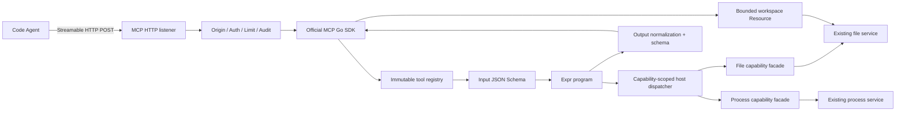
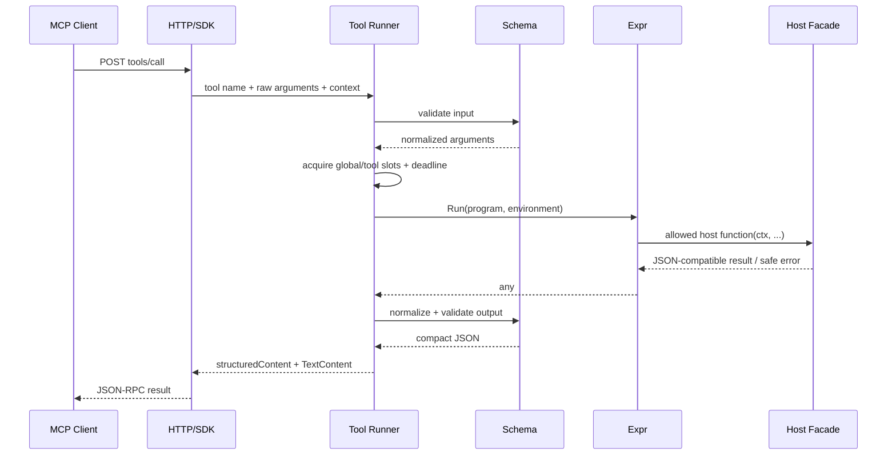

# 可配置 MCP Server 详细设计 v1

## 1. 文档状态与依据

本文是[可配置 MCP Server 需求 v1](mcp-server-requirements-v1.md)的实现设计。它描述当前
代码结构、配置模型、加载流程、Expr 执行环境、host capability、Streamable HTTP transport、
错误处理和测试方案；首版核心组件已经落地，本文也是后续兼容性与安全评审的依据。

协议以 MCP `2026-07-28` 为主，并提供 POST-only `2025-11-25` 兼容子集。实现优先使用
[官方 MCP Go SDK](https://github.com/modelcontextprotocol/go-sdk)，不自行维护完整 JSON-RPC/MCP
schema。实现开始时必须重新确认最新稳定 SDK；若稳定版尚未覆盖 `2026-07-28`，应 pin 一个经过
集成测试的明确 prerelease 版本，不使用 `@latest` 或未固定分支。2026-08-15 时官方 SDK 的
`v1.7.0` 是当前固定并经过集成测试的稳定版本。

module 定义使用 YAML 官方维护的 [`go.yaml.in/yaml/v4`](https://github.com/yaml/go-yaml)，脚本使用
[`github.com/expr-lang/expr`](https://github.com/expr-lang/expr) v1 系列，JSON Schema 验证使用
[`github.com/santhosh-tekuri/jsonschema/v6`](https://github.com/santhosh-tekuri/jsonschema)。三个依赖都必须
pin 经过测试的明确版本；若 YAML v4 仍处于 prerelease，则升级需要单独兼容性评审。

## 2. 核心设计决策

1. 一个 controller 只暴露一个 MCP endpoint；多个 `.mcp.yaml` module 聚合为一份不可变 tool registry。
2. MCP 使用独立 HTTP listener，不与现有 gRPC 端口复用。
3. 主协议无 session、无初始化状态；跨请求状态只使用显式 process/Agent/workflow handle。
4. `.mcp.yaml` 使用严格 YAML 1.2 JSON-compatible 子集，parameter/output 保持自然的 JSON Schema 树。
5. Expr 是单次 tool 的表达式语言，不是 workflow 存储或调度引擎。
6. host function 使用显式 capability allowlist；tool annotations 不参与授权。
7. 每个脚本最多一次 mutation，避免把 Expr 求值变成隐式事务。
8. gRPC 与 MCP 复用同一内部能力，不通过网络回连，也不复制安全敏感实现。
9. controller 启动采用 fail-closed 的两阶段 prepare/listen；任何 tool 错误都阻止发布 registry。
10. 首版 registry 与 Resource template 静态，`tools.listChanged=false`，不实现热加载和长连接事件流。

## 3. 总体架构



controller 仍是唯一拥有 workspace root、process registry 和 runtime store 的组件。MCP 是新的 transport
adapter，不建立第二套文件或进程状态。

## 4. 建议代码结构

```text
cmd/controller/
├── config.go                   # controller schema v1/v2/v3 解析与合并
└── main.go                     # prepare、listen、双 listener 生命周期

internal/auth/
├── auth.go                     # 现有 gRPC bearer
└── http.go                     # HTTP bearer 与 principal context

internal/mcp/
├── config.go                   # MCP typed runtime config 与校验
├── definition.go               # .mcp.yaml typed model 与 YAML AST 规则
├── loader.go                   # 安全打开、严格 YAML decode、两阶段加载
├── schema.go                   # JSON Schema 编译与资源限制
├── registry.go                 # immutable registry、排序、摘要
├── cursor.go                   # tool list cursor
├── script.go                   # Expr compile/run
├── script_policy.go            # AST 与副作用策略
├── host.go                     # host catalog、capability、effect 分类
├── host_controller.go          # controller/file/process host adapter
├── resource.go                 # 有界 workspace binary Resource
├── result.go                   # JSON 规范化与大小限制
├── runner.go                   # schema、Expr、result 与 safe error
├── server.go                   # MCP SDK server 与 HTTP server
└── server_test.go

internal/server/
└── server.go                   # 同时拥有 gRPC 与 MCP server/listener
```

`internal/mcp` 的 Go package 名称建议使用 `mcpserver`，导入官方 SDK 时使用 `mcpsdk` alias，避免
标识符歧义。若单 package 超过可维护范围，再按 `definition`、`script`、`host` 拆为内部子 package；
首版不需要提前建立过深目录层次。

## 5. 配置模型

### 5.1 Controller schema v2–v4

`cmd/controller/config.go` 当前接受 1–4：v2 引入 MCP，v3 引入 process template，v4 增加 template
extra parameters：

```go
const (
	controllerConfigVersionV1 = 1
	controllerConfigVersionV2 = 2
	controllerConfigVersionV3 = 3
	controllerConfigVersionV4 = 4
)

type controllerFileConfig struct {
	Version int `toml:"version"`
	// existing fields omitted
	MCP *mcpFileConfig `toml:"mcp"`
}
```

规则：

- v1 出现 `[mcp]` 是 strict decode/版本错误；
- v1 读取后规范化为当前 runtime model，MCP disabled；
- v2–v4 允许省略 `[mcp]`，仍表示 disabled；
- v2–v4 `mcp.enabled=true` 时所有必填项和 token requirement 生效；
- v3 及以后接受 `[process_templates]`；
- MCP 配置首版不提供 CLI override，避免 slice 的替换/追加语义不清楚。

runtime config：

```go
type Config struct {
	Enabled                 bool
	ListenAddress           string
	EndpointPath            string
	DefinitionFiles         []string
	AllowedOrigins          []string
	AllowedHostCapabilities []string
	MaxRequestBytes         int64
	MaxResponseBytes        int64
	MaxConcurrentCalls      int
	RequestsPerSecond       float64
	RequestBurst            int
	DefaultToolTimeout      time.Duration
	MaxToolTimeout          time.Duration
	ToolListPageSize        int
	TLSCertificateFile      string
	TLSKeyFile              string
	Token                   string
}
```

TLS 与 Token 从 controller 全局配置复制到 MCP runtime config，`.mcp.yaml` 文件不接触 secret。
`MaxResponseBytes` 的合法范围为 16 KiB 到 64 MiB；低于 16 KiB 会使基础 error envelope 和 Resource
预算不可用，因此在 prepare 阶段直接拒绝。

### 5.2 Prepare/listen 分离

现有 `validatedServerConfig`、`server.New` 和 `--check-config` 需要调整为：

```go
prepared, err := server.Prepare(config)
if err != nil {
	return err
}
if options.checkConfig {
	fmt.Fprintln(stdout, "configuration OK")
	return nil
}
controller, err := server.NewPrepared(prepared)
```

`Prepare` 完成所有不产生业务副作用的工作：

- 地址/TLS/token/MCP 基础校验；
- workspace 和 definition 文件 metadata 校验；
- `.mcp.yaml` strict decode 与 JSON-compatible AST 校验；
- JSON Schema 和 Expr program 编译；
- tool registry 构建、排序和摘要；
- 不创建 runtime process record、不绑定 listener、不调用 host function。

`NewPrepared` 创建 file/process service、绑定 gRPC/MCP listener、绑定 host dispatcher，并保持
all-or-nothing cleanup。保留 `server.New(config)` 作为测试或调用方兼容入口，其内部调用两阶段 API。

## 6. 定义文件加载

### 6.1 数据结构

```go
type definitionDocument struct {
	Version     int            `json:"version"`
	Namespace   string         `json:"namespace"`
	Description string         `json:"description"`
	Language    string         `json:"language"`
	Tools       []toolDocument `json:"tools"`
}

type toolDocument struct {
	Name           string           `json:"name"`
	Title          string           `json:"title"`
	Description    string           `json:"description"`
	Capabilities   *[]string        `json:"capabilities"`
	Timeout        string           `json:"timeout"`
	MaxConcurrency int              `json:"max_concurrency"`
	Annotations    *annotationsDoc  `json:"annotations"`
	InputSchema    json.RawMessage  `json:"input_schema"`
	OutputSchema   json.RawMessage  `json:"output_schema"`
	Script         string           `json:"script"`
}

type annotationsDoc struct {
	ReadOnly    *bool `json:"read_only"`
	Destructive *bool `json:"destructive"`
	Idempotent  *bool `json:"idempotent"`
	OpenWorld   *bool `json:"open_world"`
}
```

annotations 使用 pointer bool 区分“未写”与 false，四个字段都必须显式出现。input/output schema
使用 `json.RawMessage` 保留动态 JSON Schema 并通过 nil 区分缺失；`Capabilities` 使用 pointer slice 区分
缺失与显式空列表，`Annotations` 使用 pointer 区分整个 mapping 是否缺失。

### 6.2 文件打开

loader 先要求配置路径以 `.mcp.yaml` 结尾，不接受 `.mcp.yml`、裸 `.mcp` 或内容探测。随后按 controller
配置中的顺序打开文件，但最终 registry 不依赖该顺序。Linux 实现使用
`O_RDONLY|O_CLOEXEC|O_NOFOLLOW` 打开最后一个路径分量，再通过 fd `Stat` 确认普通文件、大小和
device/inode。这样既拒绝最终 symlink，也能识别同一物理文件的重复配置。错误中可以包含配置路径，
但不得包含文件内容。

loader 还要比较 definition 的 canonical physical path 与 workspace root。definition 位于 workspace
内时直接失败；不能依赖文件 mode 判断 Agent 是否“当前可写”，因为权限、运行用户或挂载方式可能在
下一次启动前改变。

单文件使用 `io.LimitReader(max+1)`，不能先无界 `ReadAll`。所有文件累计读取也受 8 MiB 上限。

YAML 只解析一次为 `yaml.Node`，parser 显式启用 unique-keys、single-document 和 depth/alias limit，
不依赖 pinned v4 可能变化的默认选项。安全 visitor 验证并把 AST 转成 JSON-compatible Go tree，随后
编码为 canonical JSON。typed model 最终由标准库 `json.Decoder` 配合 `DisallowUnknownFields` 解码，
并检查 EOF。这个路径避免 YAML decoder 为 typed bool/int 保留的 1.1 隐式转换影响配置语义。

AST visitor 必须检查：

- document 恰好一个、输入为 UTF-8、根节点为 mapping；
- 所有 mapping key 都是普通 string；
- duplicate key、merge key `<<`、anchor 和 alias 一律拒绝；
- 只允许 map、sequence、string、canonical null/boolean、十进制 int64 和 finite JSON number；
- 拒绝 directive、显式/自定义 tag、timestamp、binary、NaN、Infinity、octal 和非 JSON number；
- 节点数、嵌套深度、单 scalar bytes 和单 collection 元素数符合硬限制；
- 多行 `script` 必须使用 literal block scalar `|`/`|-`，不能用会折叠换行的 `>`。

visitor 同时构建 JSON Pointer 到 YAML line/column 的 source index，typed/schema/业务校验错误尽量映射
回原文件位置。YAML comments 允许存在，但不会进入 runtime model。JSON Schema 字段由
`json.RawMessage` 接管，因此 top-level/tool strict mode 不会拒绝合法 schema keyword；schema 内部仍
必须满足 string key 和 JSON value 约束。loader 不实现 include、环境变量插值或模板求值。

### 6.3 两阶段 registry 构建

第一阶段逐文件产生未发布的 module：

1. 校验 version、namespace、language 和 module tool 数；
2. 规范化 duration 与 capability 名称；
3. 将 YAML AST 规范化为 canonical JSON，并提取 input/output schema；
4. 编译 input/output schema；
5. parse Expr AST 并执行 policy visitor；
6. 使用 capability-scoped host signature 编译 Expr program；
7. 构建 `CompiledTool`。

第二阶段跨文件校验：

1. 拼接完全限定名称；
2. 检查名称、tool 数和 description 总大小；
3. 拒绝重复名称和重复 definition 文件；
4. 按名称排序；
5. 计算 registry SHA-256 摘要；
6. 构建只读 map/slice，并一次性发布。

任一步失败都丢弃整个 builder，不修改已有 registry。

## 7. Registry 与 Tool 表示

```go
type Registry struct {
	byName  map[string]*CompiledTool
	ordered []*CompiledTool
	digest  [32]byte
}

type CursorCodec struct {
	registryDigest [32]byte
	key            [32]byte
}

type CompiledTool struct {
	Name             string
	Title            string
	Description      string
	Capabilities     []Capability
	Annotations      ToolAnnotations
	InputSchemaJSON  json.RawMessage
	OutputSchemaJSON json.RawMessage
	InputValidator   *jsonschema.Schema
	OutputValidator  *jsonschema.Schema
	Program          *vm.Program
	Policy           ScriptPolicy
	Timeout          time.Duration
	Semaphore        chan struct{} // nil means only global limit
}
```

结构发布后不得修改。构造时复制所有 slice/map/raw bytes；`tools/list` 不返回内部可变引用。
compiled program 视为 immutable 并允许并发运行，必须由 `go test -race` 验证同一 tool 的并发调用。

cursor payload 为：

```json
{"v":1,"registry":"<base64url-sha256>","offset":100}
```

payload 使用 canonical JSON 后做 base64url 编码，再附加 HMAC-SHA-256 tag，形成
`<payload>.<tag>`。key 在 controller 每次启动时由 `crypto/rand` 生成，不落盘；decode 必须先用
`hmac.Equal` 验证 tag，再检查版本、registry digest、offset 范围和 trailing bytes。cursor 不包含
secret，也不作为授权凭据；controller 重启后旧 cursor 失效。若 pinned SDK 的内建 pagination 无法注入该 cursor 语义，
在 MCP method adapter 层实现自定义 list handler；不能为迁就 SDK 而取消需求中的 cursor 校验。

## 8. MCP SDK 集成

### 8.1 Server 构造

伪代码：

```go
sdkServer := mcpsdk.NewServer(
	&mcpsdk.Implementation{
		Name:    "remote-code-controller",
		Version: version.Version,
	},
	&mcpsdk.ServerOptions{
		PageSize: config.ToolListPageSize,
		Capabilities: &mcpsdk.ServerCapabilities{
			Tools: &mcpsdk.ToolCapabilities{ListChanged: false},
		},
	},
)

for _, tool := range registry.ordered {
	sdkServer.AddTool(toSDKTool(tool), makeToolHandler(tool, runner))
}

handler := mcpsdk.NewStreamableHTTPHandler(
	func(*http.Request) *mcpsdk.Server { return sdkServer },
	&mcpsdk.StreamableHTTPOptions{
		Stateless:                    true,
		JSONResponse:                 true,
		PropagateRequestCancellation: true,
	},
)
```

具体字段以 pinned SDK API 为准。动态 YAML schema 不能使用 SDK 的 compile-time generic input struct
注册方式；使用 raw tool handler，并由本项目显式解码/验证 input 和 output。SDK 负责：

- JSON-RPC envelope；
- `server/discover` 与旧版 initialize negotiation；
- protocol version/header 一致性；
- tools capability 和基础 method schema；
- Streamable HTTP response framing。

本项目负责：

- Origin/auth/body/rate 限制；
- tool registry 与稳定定义；
- arguments/output JSON Schema；
- Expr、host capability 和 service error；
- 审计、配额和 shutdown。

不能假定 SDK 默认安全配置足够；Origin 验证和认证 middleware 始终保留。

### 8.2 协议版本

`StreamableHTTPOptions.Stateless=true` 是 `2026-07-28` 的必需形态。SDK 还必须通过 integration test
证明同一 POST endpoint 可处理 `2025-11-25` 的 initialize/list/call。旧请求不创建 session，
GET/DELETE 返回 405。若所选 SDK 无法同时满足这两类测试，应优先保证 `2026-07-28`，并将旧版兼容
明确标记为实现 blocker，而不是恢复 controller 自己维护的 session store。

### 8.3 HTTP server

```go
type Server struct {
	httpServer *http.Server
	listener   net.Listener
	registry   *Registry
	runner     *Runner
	limiter    *rate.Limiter
	closeOnce  sync.Once
}
```

建议 HTTP 参数：

- `ReadHeaderTimeout`: 5s；
- `IdleTimeout`: 60s；
- `MaxHeaderBytes`: 64 KiB；
- `ReadTimeout`: 不设置覆盖整个 tool call 的固定短值，body read 由 middleware/deadline 限制；
- `WriteTimeout`: 至少为 `max_tool_timeout + shutdown margin`，或由每次 handler context 控制；
- handler 只注册规范化后的 `endpoint_path`，其它路径返回 404。

TLS certificate/key 与 gRPC 相同，但 HTTP server 拥有独立 `tls.Config` clone 和 listener。启动顺序必须
能够在第二个 listener bind 失败时关闭第一个 listener 和已经创建的 service。

## 9. HTTP middleware

推荐顺序：

```text
panic recovery
  -> request/invocation correlation
  -> coarse rate limit
  -> Origin validation
  -> bearer authentication
  -> method/path/content-type/accept checks
  -> body size limit
  -> MCP SDK handler
  -> response size/accounting
  -> audit completion
```

### 9.1 Origin

启动时将 allowed origin 解析为 `(scheme, lowercase host, effective port)`，拒绝 userinfo、path、query、
fragment、wildcard 和 `null`。请求没有 Origin 时允许；有且只有一个 Origin 时精确比较；多个值或解析
失败时返回 403。首版不产生 `Access-Control-Allow-Origin`。

### 9.2 Bearer auth

在 `internal/auth/http.go` 增加：

```go
func BearerHTTPMiddleware(expected string, next http.Handler) http.Handler
func PrincipalFromContext(context.Context) (Principal, bool)
```

规则与 gRPC interceptor 一致：只接受一个 `Authorization` 值和精确 `Bearer ` scheme，长度先比较，
再 constant-time compare。失败只返回通用消息和 `WWW-Authenticate: Bearer`。context principal 使用
稳定的内部 ID，不保存 token 本身。

clientInfo 是客户端自报字段，只写入 display/audit 字段，不参与身份或权限判断。

### 9.3 限流与响应限制

入口 token bucket 限制所有已认证请求；tool runner 另有全局/每 tool semaphore。429 包含合理的
`Retry-After`，不进入 Expr。

`http.MaxBytesReader` 在 SDK 读取 body 前安装。response limit 主要通过 tool result normalization 和
tools/list pagination 保证；最外层增加 counting writer 作为不变量保护。因为首版只返回 JSON，可以在
4 MiB 内缓冲完整 response 后一次性写出，避免已经发送 200 后才发现超限。缓冲区同样有硬上限。

## 10. Tool 调用流程



runner：

```go
type Runner struct {
	hosts           *HostDispatcher
	globalSlots     chan struct{}
	maxResponse     int64
	clock           Clock
	invocationID    func() string
}

func (r *Runner) Call(
	ctx context.Context,
	tool *CompiledTool,
	raw json.RawMessage,
	client ClientInfo,
) (*mcpsdk.CallToolResult, error)
```

处理细节：

1. `raw` 为空时按 `{}` 处理；非 object 直接产生 input validation tool error；
2. decoder 拒绝 duplicate/trailing JSON value，并执行 number normalization；
3. schema validation error 只返回有限条、按 JSON Pointer 排序的安全诊断；
4. 等待 semaphore 期间响应 context 取消；获取顺序固定为 global 后 tool，释放逆序；
5. effective deadline 为 HTTP deadline、tool timeout 与 global max 的最小值；
6. Expr 每次使用新的 environment map，禁止多个调用共享 args 或 call metadata map；
7. runner 对 panic 做最后防护并转换为不含敏感细节的 JSON-RPC internal handler error；
8. tool execution error 仍返回正常 `CallToolResult`，protocol/internal envelope error 才返回 handler error。

## 11. JSON 表示与 Schema

### 11.1 Canonical JSON value

内部允许：

```text
nil
bool
string
int64
float64（必须 finite）
[]any
map[string]any
```

arguments decoder 对无小数点/指数的数字优先解析 `int64`；超出范围时返回 validation error。其它 number
解析 float64 并拒绝 overflow。host function 不直接向 Expr 返回 protobuf message、`time.Time`、
`[]byte`、error、channel、function 或含私有字段的任意 struct，而是在 facade 中转换为显式 JSON tree。

`normalizeResult` 递归复制返回值并同时检查：

- 最大深度、节点数和 map key 长度；
- 只接受 string map key；
- 不接受 cyclic Go value；
- float 必须 finite；
- 紧凑 JSON 编码不超过 output limit。

同一套 walker 在 Expr 执行前检查 arguments，在执行后检查 result：嵌套深度不超过 64、单个 container
不超过 10,000 个元素、总节点不超过 100,000。检查过程自身使用显式栈或受控递归，遇到限制立即停止。

### 11.2 Schema compiler

schema 的 `json.RawMessage` 来自已规范化的 module JSON，由 jsonschema/v6 compiler 作为内存 resource
加载。compiler 只注册该 tool 的内存 resource；不配置默认 HTTP/file loader。预扫描要求显式 `$schema` 等于
2020-12 canonical URI，并拒绝 `$ref` 或 `$dynamicRef` 中的非 fragment URI，随后再编译，形成双层保护。

同一个预扫描 visitor 拒绝所有位置的 `x-mcp-header`。首版不发布参数镜像声明，因此 middleware 只需
验证 `MCP-Protocol-Version`、`Mcp-Method` 和 `Mcp-Name` 等标准镜像 header；未来若支持
`x-mcp-header`，必须同时实现 Base64 sentinel 解码、字段类型限制和 `Mcp-Param-*`/body 一致性校验。

input root 必须声明 object，且显式 `additionalProperties=false`。AST visitor 遍历 JSON Schema tree，
限制 schema depth/subschema count/regex length，并验证每个公开 property 有 description。

output schema 可为任意 JSON type。每次脚本成功后必须校验；output schema 失败说明定义或 host 实现有
bug，对模型返回通用 internal tool error，详细 schema location 只进入不含实际 result 的 debug 日志。

## 12. Expr Engine

### 12.1 编译

```go
type ScriptCompiler struct {
	catalog *HostCatalog
	limits  ScriptLimits
}

func (c *ScriptCompiler) Compile(
	source string,
	capabilities []Capability,
) (*vm.Program, ScriptPolicy, error)
```

流程：

1. 检查 UTF-8、source bytes 和 NUL；
2. 使用 Expr parser 得到原始 AST；
3. 通过 `ast.Walk` visitor 统计 node/depth/call sites；
4. 识别 host function、collection predicate、range/repeat 和最终 expression；
5. 验证 capability/effect policy；
6. 仅把获准的 host functions 作为 `expr.Function` options 注册；
7. 以固定 environment shape、`expr.AsAny()`、`expr.WithContext("__ctx")` 编译；
8. 不启用 `AllowUndefinedVariables`，不把 effectful function 标为 `ConstExpr`；
9. 保存 policy 摘要供 annotation 校验和审计。

Expr 的 optimizer 可以消除未使用的纯计算，因此 mutation 必须是最终 expression，不能把未使用的
mutation 放在 `let` 中期待执行。静态 visitor 必须直接检查 parser 产生的原始 AST，不能只检查已优化
program 的 AST。

### 12.2 Environment

```go
type scriptEnvironment struct {
	Context context.Context    `expr:"__ctx"`
	Args    map[string]any     `expr:"args"`
	Call    scriptCallMetadata `expr:"call"`
}

type scriptCallMetadata struct {
	ID         string `expr:"id"`
	Tool       string `expr:"tool"`
	ClientName string `expr:"client_name"`
}
```

实际使用 map 或 struct 需通过原型验证 Expr 对 snake_case tag 和动态 arguments 的行为。`call` 不包含
远端地址、token、绝对路径或可用于权限判断的字段。脚本能看到内部 `__ctx` 标识符并不构成权限，
但 result normalizer 会拒绝它作为输出；文档明确要求定义作者不引用内部变量。

### 12.3 Host callback

所有 context-aware callback 使用统一包装：

```go
func bindHostFunction(def HostDefinition) expr.Option {
	return expr.Function(
		def.Name,
		func(values ...any) (any, error) {
			ctx := values[0].(context.Context)
			invocation, ok := InvocationFromContext(ctx)
			if !ok {
				return nil, ErrHostUnavailable
			}
			return invocation.Dispatcher.Call(ctx, def.Name, values[1:])
		},
		def.Signatures...,
	)
}
```

`expr.WithContext("__ctx")` 负责把 context 插入声明了 context 的函数调用。signature 必须尽量具体；
接收复杂 option object 时才使用 `map[string]any`，并在 dispatcher 内再次 strict decode。

### 12.4 AST policy

visitor 记录每个 call node 所在的父节点链。规则实现为明确错误，不做静默 rewrite：

- `HostEffectRead` 可多次出现，但总 host call site 不超过 16；
- `HostEffectMutate/Destructive` 总数不超过 1；
- 最终 AST 在剥离 `let` sequence 后必须是该 mutation call；
- 任意 host call 的 ancestor 不能是集合 predicate/lambda；
- `BinaryNode("..")` 拒绝；`repeat` 等 denylist builtin 拒绝；
- collection builtin call site 不超过 32，collection lambda 嵌套不超过 2；
- annotation 由最强 effect 推导，再与配置逐项比较。

这一限制是 v1 的安全/一致性约束，不是 Expr 本身的限制。

## 13. Host capability 设计

### 13.1 Catalog

```go
type Effect uint8

const (
	EffectRead Effect = iota
	EffectMutate
	EffectDestructive
)

type HostDefinition struct {
	Name       string
	Capability Capability
	Effect     Effect
	Signatures []any
	Call       func(context.Context, *Backends, []any) (any, error)
}

type HostCatalog struct {
	byName map[string]HostDefinition
}
```

catalog 在 init/build 函数中显式注册，不支持 `.mcp.yaml` 自定义原生 function，也不通过 reflection 自动导出
controller 方法。每个函数名、capability、effect 和 signature 都有单元测试。

权限判断取交集：

```text
function required capability
    ∈ tool.capabilities
    ∩ controller.allowed_host_capabilities
```

loader 从原始 AST 汇总 host function 所需 capability。该集合必须与 tool 声明集合完全相等；缺少或
多余 capability 都是启动错误。纯表达式 tool 的集合必须显式为空。controller 的 global allowlist
可以是该 registry 所需 capability 的超集，因为它是部署级上界，不属于单个 tool 的授权。

### 13.2 Dispatcher 与 invocation

```go
type Invocation struct {
	ID           string
	Tool         string
	Capabilities CapabilitySet
	Principal    auth.Principal
	Backends     *Backends
	Budget       *HostBudget
}
```

dispatcher 每次调用再次检查 capability 和 budget，不能只依赖编译阶段。这样即使 program/cache 使用错误
也不会扩大权限。`HostBudget` 记录动态调用次数和累计返回字节，并以配置的 `max_response_bytes` 为上界；
context 取消在调用 backend 前后检查。最终 result 还会按 structured/text 同时存在时的实际 JSON 编码大小
再次校验，避免 host budget 与 HTTP response limit 使用不同常量。

### 13.3 文件 facade

建议签名：

```text
file_stat(path) -> object
file_list(path) -> array<object>
file_tree(path) -> object
file_read_text(path, max_bytes) -> object
file_read_range(path, start_line, max_lines, max_bytes) -> object
file_search(options) -> object
file_write_text(path, content, overwrite, mode) -> object
file_apply_patch(path, expected_sha256, patch) -> object
file_mkdir(path, parents, mode) -> object
file_move(source, destination, overwrite) -> object
file_chmod(path, mode) -> object
file_remove(path, recursive) -> object
```

静态 effect 采用“最坏可能副作用”：`file_stat/list/tree/read_text/read_range/search` 为 read，
`file_mkdir/chmod` 为 mutate，`file_write_text/apply_patch/move/remove` 为 destructive。即使某次调用设置
`overwrite=false`，tool metadata 也不能随 arguments 变化，因此可能覆盖或删除数据的 host function 一律按
destructive 处理。

所有返回 object 使用稳定 snake_case JSON field。`file_read_text` 在读取期间限制 bytes，验证 UTF-8，返回
`path/content/size/sha256`；超过限制不截断并伪装成功，而是返回 resource-exhausted tool error。
`file_read_range` 只返回完整 UTF-8 行和可续传 `next_line`；`file_search` 是有总扫描字节数、目录条目数、
文件数、结果数、glob 组件数和 preview 上限的 literal search，目录遍历不跟随 symlink。
`file_apply_patch` 只接受显式目标路径和单文件 unified diff，
发布前再次校验 lowercase SHA-256 前置条件。`file_write_text` 与 patch 最终都调用同一原子写入 core。

现有 `files.Service` 同时混合 domain 和 gRPC boundary。实现 MCP 时应先抽取可复用 core 方法，例如：

```go
type FileCore interface {
	Stat(context.Context, string) (FileInfo, error)
	List(context.Context, string) ([]FileInfo, error)
	ReadText(context.Context, ReadTextOptions) (*TextFile, error)
	WriteText(context.Context, WriteTextOptions) (FileInfo, error)
	// ...
}
```

`FileInfo`、`TextFile` 和 option 类型属于 `internal/files` domain，不引用 protobuf；gRPC adapter 和
MCP facade 分别完成 transport 映射并调用 core。若首个增量为了降低改动直接调用现有 unary service method，
也不得复制 `cleanPath`/`os.Root` 逻辑；streaming Upload/Download 必须抽取 core，不能伪造 gRPC stream。

### 13.4 进程 facade

建议签名：

```text
process_start(options) -> process object
process_list(all) -> array<process object>
process_get(reference) -> process object
process_signal(reference, signal, wait) -> process object
process_delete(reference) -> process object
process_logs(process_id, streams, tail_lines, max_bytes) -> log snapshot object
process_logs_since(process_id, streams, offset, max_bytes) -> log snapshot object
process_template_list() -> array<template summary>
process_template_get(name) -> template object
process_template_start(options) -> process object
```

`process_list/get/logs/logs_since` 与 template list/get 为 read；direct/template start 为 mutate；
`process_signal/delete` 为 destructive。模板读取与启动分别使用 `process_templates.read` 和
`process_templates.start`，不借用更宽泛的 process capability。

options/reference map 通过专用 strict decoder 转成 typed request；禁止未知字段。Facade 可以调用现有
process service unary method，但必须把 gRPC status 映射为 MCP safe error。日志 streaming implementation
抽取为 snapshot reader，`follow=false`；offset 使用 canonical unsigned decimal string 避免 JSON number
精度损失，达到 `max_bytes` 时返回明确 `bytes_truncated` 与可续传 `next_offset`。

`process_start` 不增加 shell、不允许 script 注入 controller 环境变量 secret，也不绕过
`MaxProcesses`。返回 process UUID 作为后续调用的显式 handle。`process_signal(wait=true)` 的等待受 tool
deadline 限制。

### 13.5 Workspace Resource

全局 allowlist 包含 `files.read` 时注册 `workspace:///{+path}` template。Resource handler 复用
`files.Service` 的 `os.Root` 与普通文件校验，只返回 binary content，不提供目录打包、写入或 subscription。
原始文件上限从 `max_response_bytes` 扣除固定 JSON-RPC/URI/MIME 余量，再按 base64 的 4/3 wire 膨胀反算，
同时不得超过文件 service 的单文件上限。Resource read 与 tool call 使用相同的全局并发额度，读取 deadline
复用 `default_tool_timeout`。

## 14. Tool annotations

加载阶段根据 host effect/capability 推导：

| 条件 | 推导 |
| --- | --- |
| 全部 host 为 read | `readOnlyHint=true` |
| 存在 mutate/destructive | `readOnlyHint=false` |
| 最强 effect 为 destructive | `destructiveHint=true` |
| `processes.start` 或 `process_templates.start` | `idempotentHint=false`、`openWorldHint=true` |
| 其它仅本地 controller host | `openWorldHint=false` |

`.mcp.yaml` annotation 与推导冲突时启动失败。`idempotent` 对普通写入不能只按函数名自动判定：定义作者必须
声明，loader 对已知绝不幂等操作强制 false。annotations 只映射到 MCP 元数据，不替代服务端权限。

## 15. Result 构造

Expr 成功值经 normalize/schema 后编码一次 compact JSON：

```go
result := &mcpsdk.CallToolResult{
	StructuredContent: normalized,
	Content: []mcpsdk.Content{
		&mcpsdk.TextContent{Text: string(compactJSON)},
	},
	IsError: false,
}
```

对 `2026-07-28`，structured content 可为任意 JSON value。对只接受旧式 object structured content 的
legacy client：

- object 结果同时设置 structured/text；
- array/scalar/null 保留 JSON text，transport adapter 可省略 legacy structured field；
- 不为了兼容而偷偷把 schema 改写成 `{ "value": ... }`。

tool error 的 text 只包含 safe message，`structuredContent` 默认省略。错误 message 最大 4 KiB，schema
validation 最多返回前 8 个问题，防止错误放大 response。

## 16. 错误分类与映射

```go
type ToolError struct {
	Kind       ErrorKind
	Safe       string
	Cause      error // 仅内部日志使用，日志仍需去敏
	Retryable  bool
}
```

内部 `ErrorKind` 至少包括 invalid-input、not-found、already-exists、permission-denied、
failed-precondition、resource-exhausted、conflict、cancelled、deadline、unavailable 和 internal。

映射原则：

- SDK/JSON-RPC envelope 错误按协议返回 protocol error；
- unknown tool 返回 `-32602`，不执行 input schema；
- argument/schema 和 controller domain error 返回 `CallToolResult{IsError:true}`；
- `context.Canceled`/`DeadlineExceeded` 在连接仍存活时返回安全 tool error；
- HTTP stream 已断开时只结束工作，不尝试写第二个错误；
- panic recovery 记录 invocation/tool/stack，不记录 args/result，客户端只看到 internal error；
- gRPC status message 不能未经检查直接透传，先按 code 转为预定义 safe template。

## 17. 并发与生命周期

### 17.1 并发

- registry、schema 和 program immutable；
- 每个调用独立 args、environment、Invocation、context；
- global semaphore 限制真正进入 tool runner 的调用；
- tool semaphore 保护昂贵或副作用 tool；
- host backend 自身仍负责 process registry/file handle 的并发安全；
- semaphore 等待不持有 service mutex；
- audit/metrics 不能在主路径执行无界阻塞 I/O。

获取 slot 的伪代码：

```go
if err := acquire(ctx, r.globalSlots); err != nil { ... }
defer release(r.globalSlots)
if tool.Semaphore != nil {
	if err := acquire(ctx, tool.Semaphore); err != nil { ... }
	defer release(tool.Semaphore)
}
```

### 17.2 启动

`internal/server.NewPrepared`：

1. 创建 file service；
2. 创建 process service并恢复历史；
3. 创建 MCP host backends/runner/SDK handler；
4. 绑定 gRPC listener；
5. 绑定 MCP listener；
6. 构造两个 server，但尚未启动 Serve goroutine；
7. 任一步失败按逆序关闭已创建资源。

`Serve` 同时运行 gRPC 和 HTTP；任一 server 非预期退出时触发共同 shutdown，并返回带 transport 名称的
错误。`Address()` 继续返回 gRPC address，新增 `MCPAddress()` 在 enabled 时返回实际 HTTP address。

### 17.3 关闭

建议顺序：

1. 标记 controller draining，MCP middleware 拒绝新 tool call；
2. 调用 `http.Server.Shutdown(ctx)` 等待在途 tool；
3. 让 process service 进入 closing，拒绝新 start；
4. gRPC `GracefulStop`；
5. 按现有规则 TERM/KILL 并回收活动进程；
6. 关闭 process store、workspace root 和 listeners；
7. deadline 到达时取消所有 invocation context、`http.Server.Close`、gRPC Stop，再强制回收。

需要调整当前“先 process shutdown、后停止 gRPC”的顺序，避免 MCP/HTTP drain 期间仍能启动新进程。
具体实现可以先统一设置 service closing flag，再 drain transports，确保新调用稳定返回 unavailable。

## 18. 安全分析

### 18.1 信任边界

| 输入 | 信任级别 | 处理 |
| --- | --- | --- |
| controller TOML | operator trusted | strict schema、无内联 secret |
| `.mcp.yaml` 文件 | operator trusted code | 安全打开、严格 YAML、compile、capability 上界 |
| MCP headers/body | untrusted | size、Origin、auth、协议校验 |
| tool arguments | untrusted | JSON Schema + host typed validation |
| Expr result | untrusted-by-construction | normalize、size、output schema |
| host/backend error | potentially sensitive | safe mapping |
| clientInfo/annotations | advisory | 不用于授权 |

`.mcp.yaml` 文件不能位于可由受管 Agent 写入的 workspace 中。loader 可以在启动时比较 definition real path
与 workspace root；如果位于 root 内直接拒绝，避免 Agent 通过已有文件写权限改变下一次重启后的 MCP
权限。即使 operator 显式配置，也要求额外的未来 escape hatch，而非首版放行。

### 18.2 主要威胁与控制

| 威胁 | 控制 |
| --- | --- |
| DNS rebinding 访问 localhost | Origin allowlist、loopback、bearer token |
| 未认证远程 RCE | MCP 强制 token、远程强制 TLS、process capability 默认不允许 |
| prompt/tool 参数路径逃逸 | 复用 `os.Root` 与现有路径校验 |
| `.mcp.yaml` 提权 | 文件不在 workspace、global capability 上界、启动编译 |
| YAML alias/decode bomb | 单 document、拒绝 anchor/alias/merge、AST bytes/depth/node 上限 |
| 表达式资源耗尽 | AST/语法/input/output/timeout/concurrency 限制 |
| host call 放大 | 禁止 predicate 内 host call、动态 HostBudget |
| HTTP header/body 混淆 | SDK 与 middleware 校验镜像 header |
| tool list/name 冲突 | 完全限定名、全局拒绝重复、稳定排序 |
| 断线后副作用重试 | 无自动 retry、稳定 handle、description 提示不确定性 |
| 日志泄密 | 固定 audit 字段、禁止 args/result/script/token/content |
| panic 导致进程退出 | per-request recovery、internal error、测试/fuzz |

工作区边界仍不是完整 sandbox。MCP `process_start` 能执行任意项目命令，生产部署仍需受限系统用户、
容器/VM、网络策略和资源限制。

## 19. 审计

```go
type AuditEvent struct {
	InvocationID string
	Tool         string
	ClientName   string
	Capabilities []string
	StartedAt    time.Time
	Duration     time.Duration
	Outcome      string
	Handle       string // optional public process/agent ID
}
```

使用 structured logger 时也不得把 args/result/error cause 自动附加。Host facade 在产生 process/Agent ID
时通过显式字段返回 audit handle。文件路径默认不写 audit；如果未来需要路径审计，必须单独设计脱敏与
保留策略。

## 20. 测试设计

### 20.1 Definition/registry 单元测试

- 正常单/多 module、多个 tool、稳定排序和 registry digest；
- cursor HMAC、offset/digest 校验以及重启失效；
- 空文件、超限、非普通文件、symlink、重复 inode；
- YAML unknown/duplicate/type/version/language 错误及行列诊断；
- 多 document、非 string key、anchor/alias/merge/tag/directive 和非 JSON scalar 拒绝；
- YAML AST depth/node/scalar/collection limits 与 literal script block 规则；
- namespace/name 边界和跨文件重复；
- duration、并发、description、tool 总数限制；
- annotations 与 effect 冲突；
- 任一 tool 错误时 registry 完全不发布。

### 20.2 Schema 单元测试

- 2020-12 object input、local `$defs`/fragment `$ref`/`$dynamicRef`；
- 其它 dialect、external file/http reference 拒绝；
- property description、additionalProperties、深度和子 schema 上限；
- 任意位置的 `x-mcp-header` 被拒绝；
- int64/float 解析、超范围和 duplicate/trailing JSON；
- output object/array/scalar/null；
- validation error 截断和不包含实际敏感 value。

### 20.3 Expr/policy 单元测试

- `let`、map/filter/reduce 与 JSON object 构造；
- 未定义变量、未声明 capability、global capability 不允许；
- 多声明 capability 失败，纯表达式只接受显式空 capability；
- 一个最终 mutation 成功；两个 mutation、mutation in let/predicate 失败；
- host call in collection predicate、range、repeat、AST/depth/call limit 失败；
- context 传入自定义 host function，deadline/cancel 生效；
- program 多 goroutine 并发 run 通过 race test；
- output cycle/unsupported Go type/NaN/depth/size 被拒绝。

### 20.4 Host 单元测试

- 每个 host function 的 capability/effect/signature 固定测试；
- 文件相对路径、绝对路径、各位置 `..`、symlink escape、根删除；
- text UTF-8 与 read/write byte limits、原子发布；
- process start/list/signal/delete/log snapshot 与现有状态机一致；
- dispatcher runtime 二次 capability 校验和 HostBudget；
- gRPC status/domain error 不泄露绝对路径或内部 cause。

### 20.5 HTTP/MCP 集成测试

使用 loopback `:0`、临时 workspace/runtime、真实 HTTP client 和官方 MCP client：

- `2026-07-28` discover/list/call 完整闭环；
- `2025-11-25` POST-only initialize/list/call；
- GET/DELETE 405、错误 endpoint 404；
- token/WWW-Authenticate、Origin、TLS、request/response limits；
- protocol/method/name header mismatch；
- pagination/cursor/排序/旧客户端 structured text fallback；
- input validation tool error 与 unknown tool protocol error；
- 全局/tool concurrency、429、deadline、客户端断开；
- shutdown drain 与强制关闭；
- 审计字段存在且不含 args/script/content/token。

### 20.6 Fuzz 与全量验证

- fuzz JSON-RPC envelope、header value encoding、cursor、YAML AST normalizer 和 result normalizer；
- fuzz schema/resource limits 时不得 panic 或无界分配；
- `go test ./...`；
- `go test -race ./...`；
- `go vet ./...`；
- `go build ./...`。

测试不需要外部 MCP 服务、OAuth provider、Code Agent 凭据或公网网络。

## 21. 实施顺序

### 阶段 1：定义与编译

- controller schema v1/v2/v3 compatibility；
- `.mcp.yaml` typed model、安全 loader、JSON Schema compiler；
- Expr catalog/policy/compiler、immutable registry；
- `--check-config` 覆盖全部新校验。

### 阶段 2：Host facade

- 抽取 file streaming core 为普通 context API；
- 文件 stat/tree/range/search/write/checked-patch host；
- process get/start/offset-log/template host；
- capability/effect/budget/error mapping。

### 阶段 3：MCP transport

- pin 官方 SDK；
- stateless server、tool/Resource 注册、runner/result；
- HTTP listener、Origin/auth/limits/rate/audit；
- 双 listener startup/shutdown。

### 阶段 4：兼容与文档

- 新旧协议 integration test；
- `configs/mcp/controller.mcp.yaml`、`configs/mcp/file.mcp.yaml`、`configs/mcp/process.mcp.yaml` 示例；
- 更新 controller configuration、README、部署和 Code Agent 连接说明；
- 完整 race/fuzz/security review。

每个阶段都保持 build/test 通过。MCP 全局默认关闭；加载示例 module 时，operator 仍需在
`allowed_host_capabilities` 中逐项明确允许其中的 read/write/process/template 能力。示例不默认暴露
`files.delete`、`processes.delete`、任意自选 signal、stdin、PTY attach 或日志 follow。

## 22. 备选方案与取舍

### 22.1 为什么使用严格 YAML 子集

TOML 适合 controller 这类层级较浅的运行参数，但用 table 表达 `properties/items/anyOf/$defs` 会迅速
变得冗长，tool sequence 和多行 Expr 也不自然。JSON 与 JSON Schema 最一致，但缺少注释且多行脚本
需要转义。HCL 和 CUE 都会再引入一套表达式/求值模型，与 Expr 的职责重叠。

因此 module 使用 `.mcp.yaml`，但 YAML 只作为人类友好的 JSON 表面语法。完整 YAML 的 alias、tag、
merge、隐式扩展类型和多 document 不进入应用模型；loader 先校验 AST，再规范化为 JSON，后续 typed
definition、JSON Schema 和 registry 构建都不感知 YAML。首版只接受 `.mcp.yaml`，不做格式探测或多格式
兼容。

### 22.2 为什么不用 gojq

Expr 与 Go struct/map、自定义函数和静态类型检查结合更直接，适合 controller host API。jq 在纯 JSON
重塑上更强，但引入第二套表达式语法和多值 iterator 语义会增加 tool contract 复杂度。首版只保留
Expr；若以后确有 jq 兼容需求，作为独立 language version 加入，不改变现有 script 语义。

### 22.3 为什么不直接用 Starlark

本需求中一个 tool 应完成一次有界操作，多步骤持久化逻辑属于 workflow runner。Starlark 会立即引入
循环、用户函数、模块、执行步数、可重入 host call 和更复杂的副作用语义。先用 Expr 加严格 policy，
在真实用例证明需要完整脚本后，通过独立 `ScriptEngine` 接口增加新 language。

### 22.4 为什么不回连 gRPC

loopback gRPC 会重复序列化、认证和 streaming adapter，并让 MCP host function 依赖网络 listener
生命周期。进程内 facade 能复用同一 core 和 context，错误与取消也更准确。所有 transport 都应是
application service 的 adapter，而不是互相调用。

### 22.5 为什么独立端口

当前 gRPC server 直接拥有 `net.Listener`，并未置于通用 `http.Server`。同端口复用需要 h2/h2c、TLS
ALPN、content-type routing 和更复杂的 graceful shutdown。独立端口减少首版风险；以后若运维明确需要
单端口，可以在保持 endpoint/auth 不变的前提下增加经过测试的 HTTP/2 multiplexer。

## 23. 已知限制

- Expr 内建求值没有通用的强制中断机制，首版依赖 trusted definition、AST denylist 和输入硬上限；
- POST JSON response 不提供 progress notification，长任务应返回 process/workflow handle；
- 静态 bearer token 没有 per-user scope，所有授权主要来自 server/tool capability 配置；
- 首版不支持 `x-mcp-header` 参数镜像；
- `.mcp.yaml` 不支持 anchor、merge、include、模板或多 document，复用应由生成工具在启动前完成；
- POST-only legacy 兼容不覆盖依赖 GET SSE/session 的旧客户端；
- 网络断开后副作用结果可能未知，首版没有持久化 idempotency cache；
- tool registry 修改需要重启 controller；
- MCP 暴露的进程执行能力仍不是 OS sandbox。
